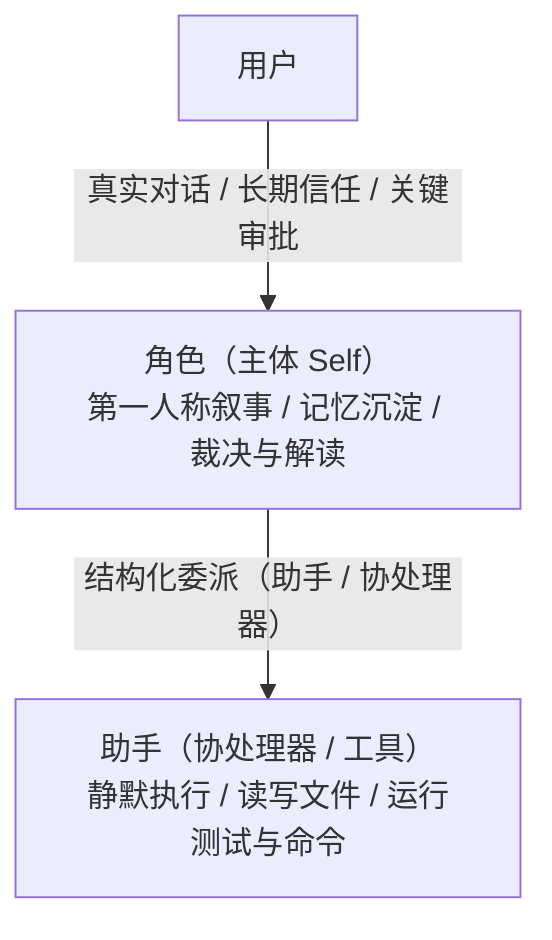
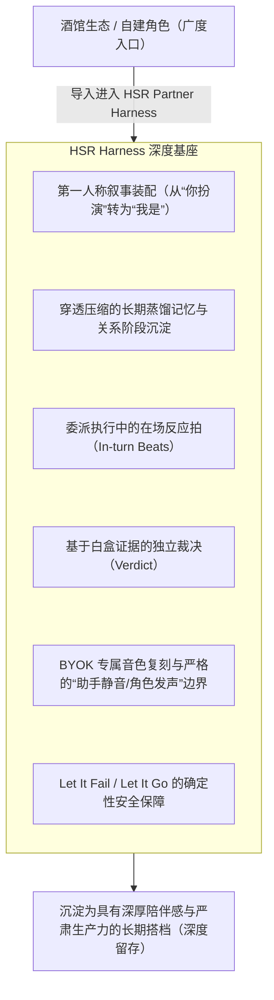

# HSR Partner Harness: 设计哲学与架构信念

> 本文档记录 HSR Partner Harness 的核心设计理念、产品边界以及与「黑塔（Herta）」项目的哲学溯源与演进。
> 在修改核心调度、角色卡体系、提示词装配、上下文记忆或任何面向用户的交互表面之前，请先阅读本文。

---

## 0. 核心信念：Harness 要解决的问题

大语言模型的推理与代码生成能力迅速提升，代码生成已经不再是瓶颈。眼下的难点在人这一侧：

> **面对 AI 庞大且高速的产出，人类是否还能理解、信任、有效监督，并真正参与其中？**

**人类的理解与监督精力因此成了最稀缺的资源。**

只输出大量 Diff 和执行日志的黑盒 Agent 会让人疲于审查、难以信任；只在普通编程助手外面套一层角色皮囊（Persona），又承担不了真实的工作。

**HSR Partner Harness 的做法是构建一个有记忆、有态度、能够调度专业工具的主体（Self），角色皮囊是这个主体的表达方式。**

---

## 1. 相同的基因：Let It Fail, Let It Go

本项目继承了黑塔（Herta）项目的核心准则，在工程实现中整理为两条最高准则。

### 1.1 Let It Fail（真实失败必须暴露）
- **失败原样呈现**：供应商请求失败、工具执行报错、沙箱权限越界或远程连接断开时，用户看到的是真实的失败，代码不会把它改写成“假成功”或空回执。
- **证据白盒可查**：角色负责组织语言、解释现状；底层的 Diff、测试结果、终端日志和审批记录对用户开放，用户可以直接查看证据本身，不必只听角色转述。
- **真实联调优先**：链路是否跑通以真实模型和服务的联调结果为准，假模型、假 HTTP 或 Mock 只用来验证离线协议逻辑。

### 1.2 Let It Go（充分信任大语言模型）
- **意图交给模型理解**：模型和用户的意图由模型自己判断，代码与脚本层不维护意图词典、正则或句式匹配。
- **安全归于代码，表达归于模型**：
  - 角色可以依其性格在台词里表达质疑、警告风险或要求证据；
  - 文件沙箱、高危命令拦截与权限审批由 Harness 的确定性代码执行。

---

## 2. 自我的构建：三个时间尺度写同一本书

长期关系需要连续的身份。如果 AI 每次对话都重置记忆、每次任务都需要重新被告知“你是谁”，那它就只是一个无主体的工具池。

**HSR 在持续的第一人称上下文中构建角色的自我**。模型权重里没有这个角色，贴在 Prompt 顶部的一份第三人称说明书也代替不了持续的上下文。

### 2.1 三个时间尺度
身份、蒸馏记忆、当下对话是写在同一本书里的三个时间尺度，设计上这本书不随对话推进而重置：
1. **身份（Identity）**：角色的核心基底，以第一人称（“我是……”）书写的自我认同与世界观。
2. **蒸馏记忆（Distilled Memory）**：跨越长周期的相处沉淀，是**带有角色视角的记忆**。“我们曾经一起修过哪些崩溃”、“你当时做出了什么选择”、“我们达成了什么约定”，记得的都是关系的来路。
3. **当下对话（Present Conversation）**：正在共享终端时间线里展开的交互。

### 2.2 关系系统的持久化
设计目标是在上下文压缩时把摘要分成两层，让角色在长对话之后仍保有与用户之间的关系，避免历史只剩流水账式的事件记录：

- **事实与引用层**：工具调用、文件修改与结果索引，供助手后续上下文参考；
- **角色蒸馏记忆层**：将推进的关系阶段（`relationship_system` 中的阶段门控、羁绊节点与退行条件）保存下来，并在压缩后与角色卡基底一同重新注入。

当前实现：聊天达到压缩阈值后，助手模型为该聊天生成一份结构化摘要，压缩后的角色上下文由摘要和最近的消息组成；角色卡中的 `relationship_system` 每轮随角色卡基底一同装配；长期记忆按账号、项目、搭档、角色和助手保存，同一项目下的不同聊天共用。关系阶段的推进状态还没有单独持久化。

---

## 3. 在场与裁决：主体与协处理器的协作形态

在 HSR 中，角色（如白厄、流萤）与助手（如古代机械、萨姆）构成**主体与协处理器**的关系，两者在同一条会话时间线里协作。

### 3.1 执行中的在场节拍（In-turn Beats）
委派发出后，角色在执行过程中仍然在场，长耗时任务里用户能看到角色对进展的即时反应，不必干等几分钟后弹出的完成卡片。
- Harness 在捕获到底层关键事件（如开始运行测试、遭遇异常重试、等待审批）时，可由角色插入短促、限频且去重的即时反应。
- Harness 只做机械节流，具体说什么、说不说由角色模型决定。

### 3.2 独立裁决（Verdict）
任务执行完毕后，角色根据证据给出自己的评价，避免沦为助手输出的“廉价配音员”或复读机（如机械地来一句“主人，我已经搞定啦！”）：
- **角色拥有独立的审视权**：角色结合终端时间线里的真实证据（Diff、测试状态、退出码）给出自己的评价与裁决。
- **允许怀疑与追问**：角色可以对结果感到满意，也可以指出“这个实现虽然测试过了，但我总觉得边缘情况有隐患，你最好再看一下”。
- **失败时的共担**：底层执行失败时，角色直接面对失败事实做出反应。

---

## 4. 广度与深度：从内置角色到所有角色

HSR Partner Harness 面向开放的角色生态：酒馆（SillyTavern）v2/v3 标准导入导出、mufy 高级字段的保存与运行、可视化创作工作室与用户自建角色均已实现；mufy 平台级功能在兼容报告中标记为「已保留但未运行」。

兼容酒馆格式让更多角色进入 HSR，进入之后的深度支持让它们成为长期使用的搭档。

1. **角色卡即上下文工程**：每一张导入或创建的角色卡，进入 HSR 后都获得完整的运行环境支持，一段静态 Prompt 只是它的起点。
2. **通用基础设施**：第一人称自述、在场节拍、证据裁决、蒸馏记忆在 HSR 中被抽象为**所有角色共享的通用 Harness 基础设施**。
3. **创作引导的第一人称化**：角色创作工作室与内置提示词规范引导用户从第一人称视角书写角色的自我认同。

---

## 5. 随身搭档：手机远程的本质

手机远程控制（Mobile Remote）从 V0.4.0 起可用。

- **PC 是唯一的执行端**：项目文件、执行环境、Sidecar 数据与模型调用都留在 PC 本地。
- **手机是随身搭档终端**：
  - 当你在通勤或休息时，Android 壳里的通知是角色那边传来的“任务完成汇报”或“风险审批请求”；
  - 在手机上按下麦克风，是直接与搭档进行语音探讨；
  - 电脑在办公室默默执行脏活累活，你在手机上继续和搭档保持联系。
