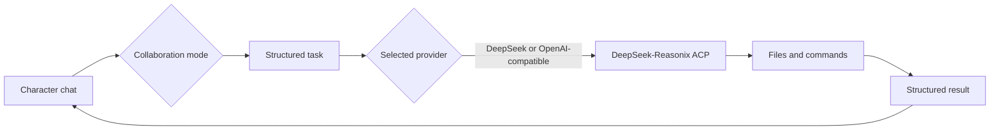

# HSR Partner Harness

[简体中文](README.md)

**Build something real with the characters you love.**

HSR Partner Harness is a Windows desktop workspace where the character you love talks through the idea with you, hands the work to a coding assistant, and watches it run on your own machine. The character has a persona, a world book, memories, and a voice of their own. The assistant does the work and brings the process and results back to you.

Project website: <https://jonah-wu23.github.io/HSR_Partner_Harness/>

[](https://github.com/Jonah-Wu23/HSR_Partner_Harness/releases)
[](https://github.com/Jonah-Wu23/HSR_Partner_Harness/actions/workflows/ci.yml)
[](https://jonah-wu23.github.io/HSR_Partner_Harness/)
[](https://jonah-wu23.github.io/HSR_Partner_Harness/)

## What you can do

**Talk the plan through with a character, delegate the task to a real coding assistant, and keep the conversation going around the results.**

- **The character discusses, the assistant executes.** Built-in pairs such as Phainon and the Mysterious Ancient Machine each come with their own theme and voice. Check "hand it to the assistant" in the composer, or let the character delegate on their own; the assistant runs through the bundled DeepSeek-Reasonix ACP against your local project folder, really writing files and running commands, and tool activity returns as structured cards in the same timeline.
- **Bring your own characters.** Create a card from scratch in the character studio, or import SillyTavern Character Card v2/v3 files as JSON or PNG. Export works both ways, so you can share your characters too. Avatars, world books, relationship stages, and event pools travel with the card.
- **Let the character speak.** Upload reference audio for a character and generate that character's voice with your own DashScope account. Character replies can be read aloud; push-to-talk or VAD lets you brief the character by voice.
- **Leave the desk, keep the work moving.** After pairing by QR code, your phone can keep chatting, watch task progress, handle approvals, and play character voices. Execution and data stay on the PC, which needs to be on and online.

Windows x64 · Open source under Apache-2.0 · Bring your own model and voice accounts · Unofficial fan work; character names and lore belong to their rights holders.

## One session, two work tracks

The tagline describes the product structure: chat mode keeps the character conversation focused, while collaboration mode opens the assistant workspace beside it. Context stays connected across the switch, so the character can react to execution results.

| Focus | What it means |
| --- | --- |
| Visible task control | Tool calls and execution states show up in the assistant workspace. |
| Pairs follow the conversation | Avatars and theme colors follow the current conversation's pair. |
| Local project binding | Each project maps to a local folder where the assistant reads, writes, and runs commands. |
| Character-bound voice | Character voices load from the current card binding; the assistant stays muted. |

## Quality gates

GitHub Actions runs Python tests, frontend tests and builds, plus Rust formatting and tests on a Windows runner. Pull requests trigger dependency review, while CodeQL checks the Python and TypeScript code.

## How it works



See the [product website](https://jonah-wu23.github.io/HSR_Partner_Harness/) for the visual walkthrough.

## Features

| Feature | Notes |
| --- | --- |
| Chat mode | The whole screen shows the character conversation, with the coding tools closed. |
| Collaboration mode | The character chat and the assistant workspace share the screen, and you can keep talking while a task runs. |
| Character cards | Create cards in the studio or import SillyTavern Character Card v2/v3 as JSON or PNG; export to v3 JSON and PNG with the avatar embedded. Unrecognized third-party extensions survive a round trip. |
| Custom character voices | Upload reference audio for any character and generate a voice with your own DashScope account; regenerate or unbind at any time. ASR and TTS models are fixed. |
| Mobile remote | Pair by QR code over Cloudflare Quick Tunnel or LAN, then chat, watch tasks, handle approvals, and play character voices from the phone. The PC must stay on and online. |
| Projects | Each project maps to a local folder. The name defaults to the folder name, and you can change it any time. |
| Chat titles | A new conversation shows "新聊天" first. After the first complete reply, the assistant generates a title from the content, and manual renames take priority. |
| Coding | The assistant reuses the OpenAI-compatible endpoint configured for dialogue and runs through the bundled DeepSeek-Reasonix ACP. Tool work shows up as cards. |
| Reasoning levels | The selected provider is shared by the character and the assistant. The composer maps five interface levels to provider effort values. |
| Approvals | Each project can save an approval policy for tool execution, and approvals can be answered from the phone. |
| Voice | Voice runs on DashScope ASR and TTS with fixed model names. Character replies can be read aloud, while tool records stay silent. |
| UI | There are dark and light themes, and you can reselect a project folder at any time. |

Three pairs are built in: Phainon with the Mysterious Ancient Machine, Firefly with Sam, and March 7th with the Fourth Mirror. Your own cards join the same directory and pair with the same assistants.

## Mobile remote

Generate a pairing code or QR code in the settings page and open it in the phone browser. Two connection paths are available:

- **Cloudflare Quick Tunnel (recommended).** One switch downloads the official `cloudflared` binary, verifies its SHA256 checksum, and hosts it as a child process. The phone reaches `https://*.trycloudflare.com` over HTTPS from cellular networks, which satisfies the secure-context requirement for the microphone. The hostname changes on every start, so the QR code needs to be regenerated; tunnel traffic crosses Cloudflare's edge.
- **LAN direct connection.** An explicit switch exposes the service on the local network with a persistent warning banner, suitable for trusted networks.

Safety boundaries: a pairing code is one-time and short-lived, only the latest code is valid, repeated failures lock the source out, and device tokens expire after 30 days absolute or 7 days idle. You can revoke any device from the desktop at any time. Tunnel hostnames appear in public certificate-transparency logs; seeing the address is not having access, and the real defenses are the pairing code and device tokens.

Local notifications for task completion, delegation results, and approval requests are delivered inside the Android shell; mobile browsers have no system notifications. The phone is a remote terminal for the PC: model calls, task execution, and business data all stay on the computer.

## Screenshots

Real screenshots from the desktop app:

First launch asks you to pick a local project folder; the project is created from the folder name.


Chat mode keeps the character conversation focused.


New chats pick a pair from the directory; the theme follows the current pair.


Collaboration mode shows the assistant workspace next to the character chat. Delegations carry a source marker, and results come back as structured cards in the same timeline.


Voice settings use your own DashScope account. Built-in pairs provide five cloned voices and one sound-design voice; custom characters take reference audio and get their own generated voice on the same account, with preview, regeneration, and unbinding. The ASR/TTS models are shown as fixed values, and failed voice generations can be retried individually. Character replies feed into the auto-read channel, while tool records stay silent. Listening state and VAD prompts appear next to the input area.


## Download

The Windows x64 installer is published on [GitHub Releases](https://github.com/Jonah-Wu23/HSR_Partner_Harness/releases). The current release is [v0.4.0](https://github.com/Jonah-Wu23/HSR_Partner_Harness/releases/tag/v0.4.0); download `HSR Partner Harness_0.4.0_x64-setup.exe`. First-time installation may trigger a Windows SmartScreen warning.

The app includes a demo mode for the interface and interaction experience. Add model settings to run live models. Live coding uses the bundled DeepSeek-Reasonix runtime and reuses the endpoint you configured for dialogue.

## Verification record

v0.4.0 release baseline, measured on 2026-09-13:

| Check | Result |
| --- | --- |
| Python | `1202 passed, 4 skipped` |
| Desktop Vitest | 47 suites, `503 passed` |
| Mobile Vitest | 30 suites, `361 passed` |
| TypeScript | `tsc --noEmit` clean |
| Rust | `cargo fmt --check` no diffs, `cargo test` `28 passed` |
| Real-device acceptance | 11 of 12 matrix items passed; the one failure (M10) was fixed and re-tested by simulation (see the [acceptance record](docs/plans/V0.4.0-真机验收记录.md), in Chinese) |
| Release gates | All 14 items verified (same document, §7) |

Known boundaries are written down in the [v0.4.0 release notes](docs/release-notes/v0.4.0-release-notes.md): iOS Safari/PWA untested (no device available), mobile weak-network and four-conversation load scenarios not executed, and system notifications on the phone limited to the Android shell.

## Live mode

When running from source, live coding uses the `reasonix` executable from the DeepSeek-Reasonix runtime. Check the runtime you plan to use:

```powershell
reasonix --version
```

Then copy [.env.example](.env.example) and fill in the model settings. Running from source reads `.env` in the repository root, while the installed application reads `%LOCALAPPDATA%\PairHarness\.env`. To keep the config somewhere else, set `PAIR_HARNESS_ENV_FILE` to that path.

The app starts in live mode by default, with no `.env` and no environment variable required, and you can finish first-run onboarding without any key in place (the onboarding flow saves and tests an account-level key). Demo mode is only entered when explicitly requested, via `PAIR_HARNESS_DEMO=1` or by launching the desktop app with `--demo`; `PAIR_HARNESS_REAL=1` explicitly declares live mode. If the two variables point at different modes the startup fails with a configuration conflict instead of guessing.

The dialogue model works with DeepSeek and OpenAI-compatible endpoints. The variables are:

| Variable | Purpose |
| --- | --- |
| `PAIR_HARNESS_DIALOGUE_BASE_URL` | OpenAI-compatible endpoint for the dialogue model. |
| `PAIR_HARNESS_DIALOGUE_API_KEY` | Dialogue model API key. |
| `PAIR_HARNESS_DIALOGUE_MODEL` | Dialogue model name. |
| `DASHSCOPE_API_KEY` | DashScope API key for voice. |
| `PAIR_HARNESS_DASHSCOPE_HOST` | DashScope workspace host. |

Reference audio and sound-design prompts ship with the project resources, and generated voice IDs are saved per local account. Users only fill in their own DashScope API Key and service base URL on the voice settings page; the API Key is masked and never written into the README or event logs.

## Run from source

Development needs Python 3.11, and desktop builds need Node.js 22 and Rust stable.

```powershell
python -m venv .venv
.\.venv\Scripts\python.exe -m pip install -e ".[voice,dev]"

Set-Location desktop
npm install
npm run build:sidecar
npm run tauri:dev
```

Release builds copy the native Windows DeepSeek-Reasonix runtime into the installer. The build
machine needs `reasonix` installed, or the `PAIR_HARNESS_REASONIX_NATIVE_ROOT` variable set:

```powershell
npm install -g reasonix
Set-Location desktop
npm run tauri:build
```

The installer is written to `desktop/src-tauri/target/release/bundle/nsis/`, and the directly
runnable GUI executable is `desktop/src-tauri/target/release/hsr-partner-harness.exe`. Normal
launches hide the console window. For development diagnostics, run
`hsr-partner-harness.exe --debug-console` (`--console` is an alias) to keep a console and see
Sidecar logs.

## Tests

Python:

```powershell
.\.venv\Scripts\python.exe -m pytest -q
```

Frontend tests and builds, all in `desktop`:

```powershell
Set-Location desktop
npm test -- --run
npm run typecheck
npm run build
```

Rust:

```powershell
Set-Location desktop\src-tauri
cargo test
```

## Build the installer

```powershell
Set-Location desktop
npm run build:sidecar
npm run tauri -- build --bundles nsis
```

The finished installer is written to `desktop/src-tauri/target/release/bundle/nsis/`.

## Repository layout

| Path | Contents |
| --- | --- |
| `desktop/` | Tauri desktop client and React UI, including the mobile PWA and Android shell. |
| `src/pair_harness/` | Python sidecar and application logic. |
| `config/` | Pair configuration and prompts. |
| `assets/` | Runtime model files. |
| `tests/` | Python tests. |
| `docs/` | Documentation; start from `docs/README.md` (Chinese). |

## Third-party code

This project is inspired by [Herta](https://github.com/PersonaCLI/Herta).

The provider detection and reasoning-effort semantics in `src/pair_harness/config/providers.py` are rewritten from [DeepSeek-Reasonix](https://github.com/esengine/deepseek-reasonix), which uses the MIT License. The full notice is in [THIRD_PARTY_NOTICES.md](THIRD_PARTY_NOTICES.md).

The coding assistant reuses the OpenAI-compatible endpoint configured for the dialogue model
(Chat Completions) and handles files and commands through the bundled DeepSeek-Reasonix ACP. The
previously bundled [OpenAI Codex](https://github.com/openai/codex) app-server was removed under
product decision B-03 and is not part of current builds.

## License

The code is under the [Apache License 2.0](LICENSE). Copyright © 2026 Zonghe Wu.

Phainon, Firefly, and March 7th are characters from *Honkai: Star Rail*, © HoYoverse. This work is an unofficial fan project, not affiliated with or endorsed by HoYoverse in any way. Game-derived material (character art, voice lines, original text) is fan-made content subject to HoYoverse's Fan Content Policy, and is not covered by the Apache License 2.0.
