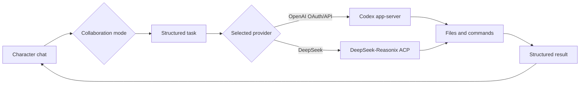
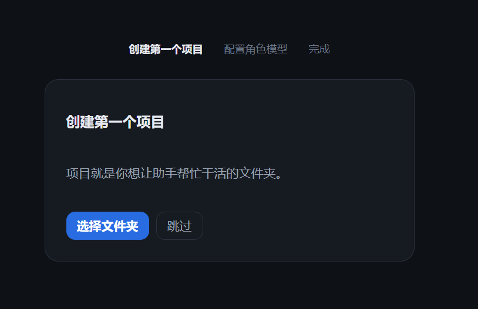
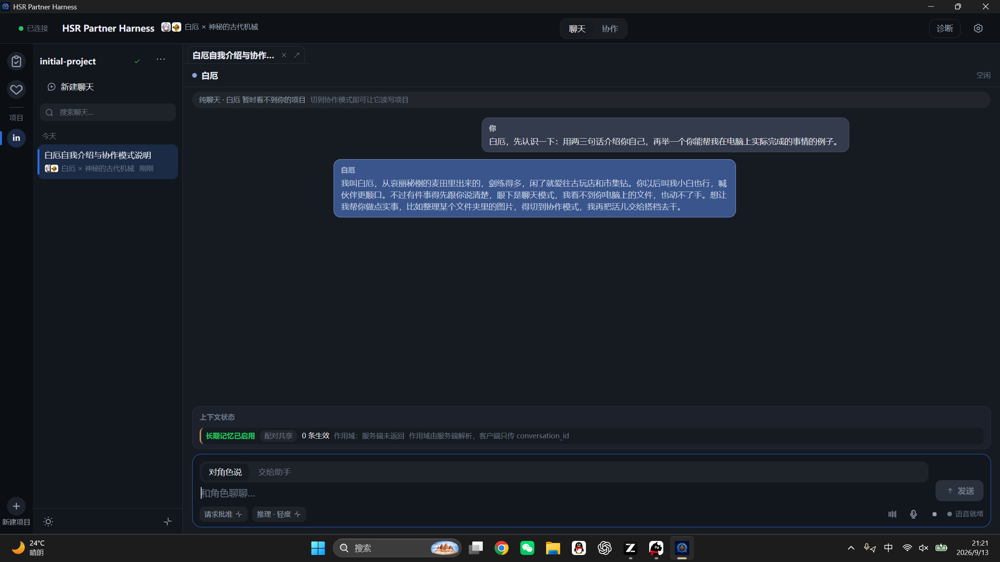
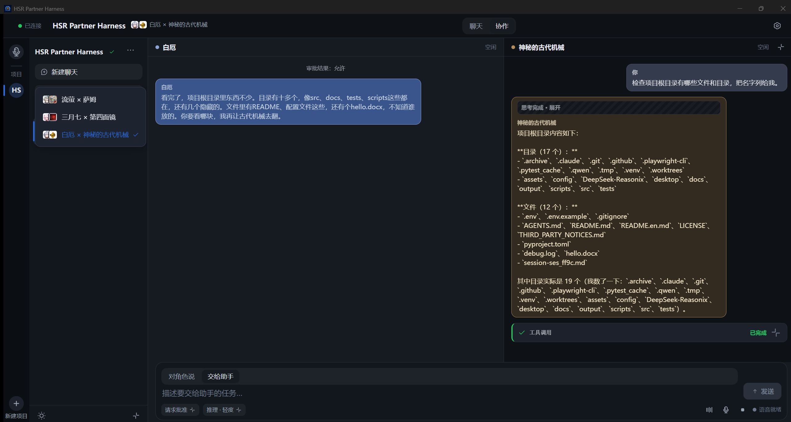
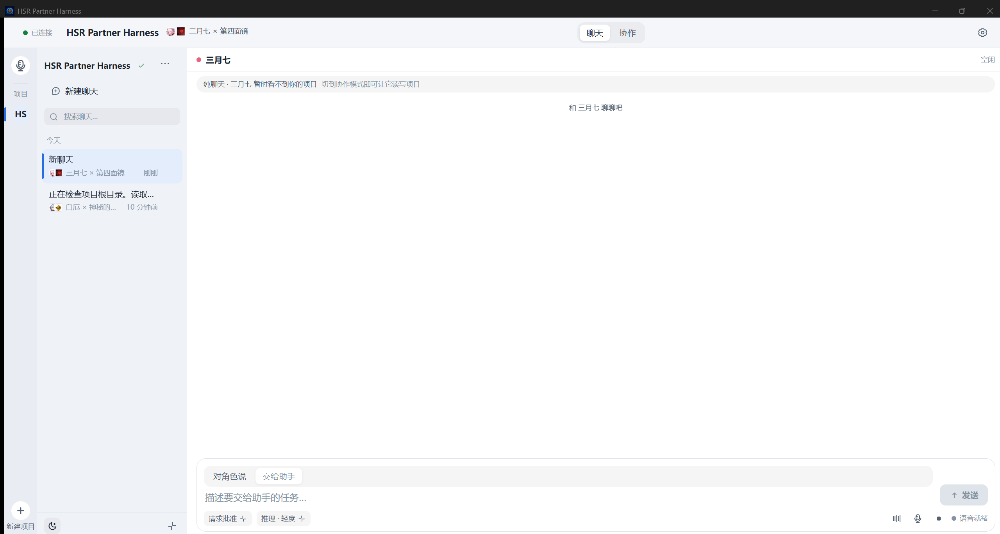
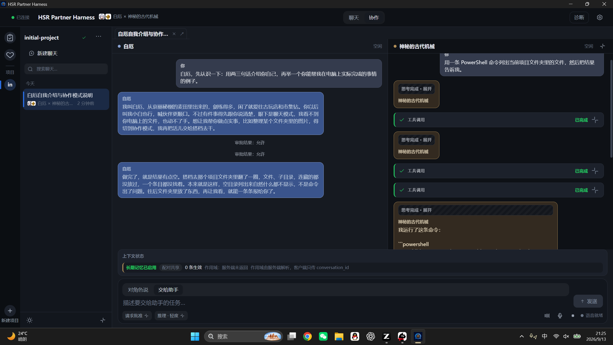
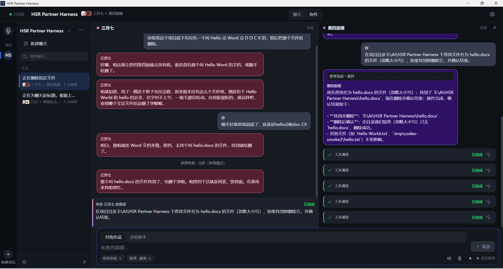
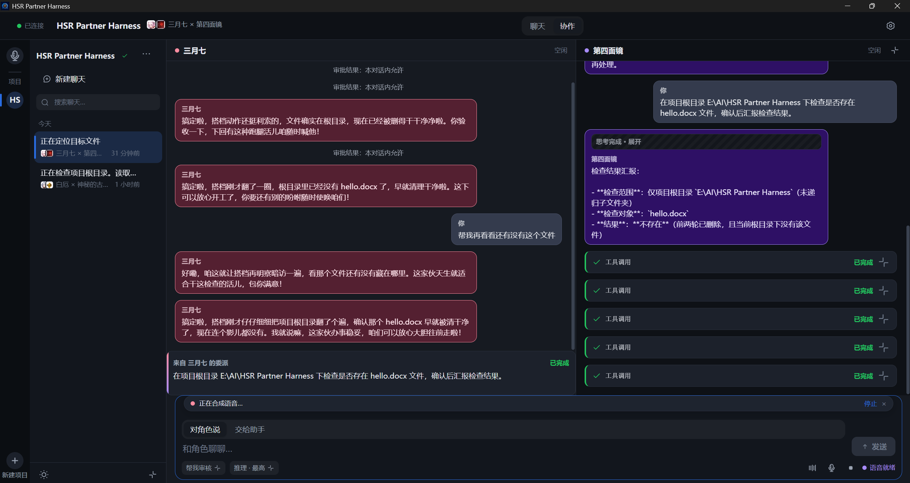
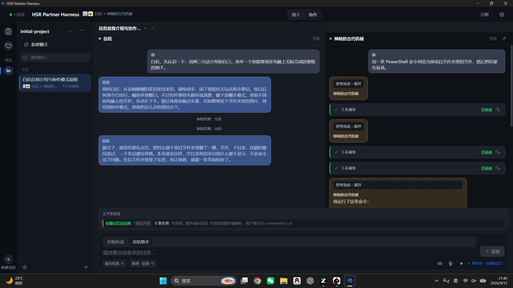
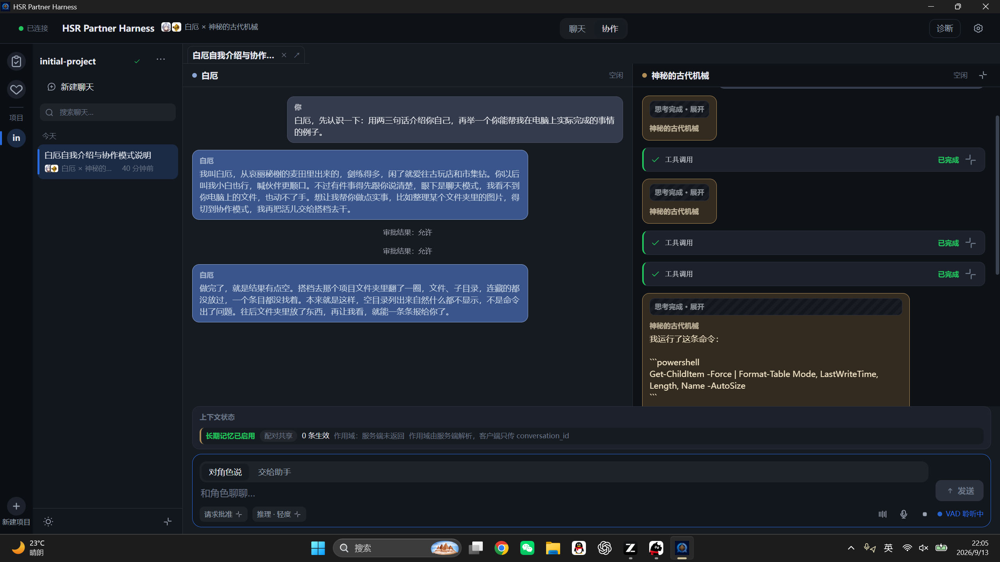

# HSR Partner Harness

[简体中文](README.md)

[](https://jonah-wu23.github.io/HSR_Partner_Harness/)
[](https://jonah-wu23.github.io/HSR_Partner_Harness/)
[](https://github.com/Jonah-Wu23/HSR_Partner_Harness/releases)
[](https://github.com/Jonah-Wu23/HSR_Partner_Harness/actions/workflows/ci.yml)

Project website: <https://jonah-wu23.github.io/HSR_Partner_Harness/>

HSR Partner Harness is a Windows desktop app where character chat and local AI coding happen in the same conversation. You can talk the plan through with Phainon first, hand the task to the Mysterious Ancient Machine once you agree, and the progress and results come back into the same conversation for Phainon to respond to.

The current release is `v0.3.1`. The interface is built with Tauri 2 and React, and a Python sidecar manages session state and model calls.

The product is a local Windows workspace for development and research prototypes, with character-driven interaction built into the workflow. It keeps planning and execution in one session. The current release focuses on local Windows workflows, with model requests sent to the provider configured by you.

## Quality gates

GitHub Actions runs Python tests, frontend tests and builds, plus Rust formatting and tests on a Windows runner. Pull requests trigger dependency review, while CodeQL checks the Python and TypeScript code.

## Product focus

| Focus | What it means |
| --- | --- |
| One session, two work tracks | Chat mode keeps the character conversation focused. Collaboration mode opens the assistant workspace while the conversation stays available. |
| Unified model provider | If onboarding or settings selects OpenAI OAuth/API, both the character and the ancient machine use GPT. If it selects DeepSeek, both use DeepSeek. |
| Visible task control | OpenAI configuration runs through Codex app-server; DeepSeek configuration runs through the bundled DeepSeek-Reasonix ACP. Tool activity appears as structured cards. |
| Local project binding | Each project maps to a local folder, while the Python sidecar owns session state and SQLite stores local data. |

| Composer level | API effort |
| --- | --- |
| Light | `low` |
| Medium | `medium` |
| High | `high` |
| Extra high | `xhigh` |
| Maximum | `max` |

## How it works



See the [product website](https://jonah-wu23.github.io/HSR_Partner_Harness/) for the visual walkthrough.

## Download

The Windows x64 installer is published on [GitHub Releases](https://github.com/Jonah-Wu23/HSR_Partner_Harness/releases). First-time installation may trigger a Windows SmartScreen warning.

The app includes a demo mode for the interface and interaction experience. Add model settings to run live models. OpenAI uses the bundled Codex; DeepSeek uses the bundled DeepSeek-Reasonix runtime.

## Features

| Feature | Notes |
| --- | --- |
| Chat mode | The whole screen shows the character conversation, with the coding tools closed. |
| Collaboration mode | The character chat and the assistant workspace share the screen, and you can keep talking while a task runs. |
| Projects | Each project maps to a local folder. The name defaults to the folder name, and you can change it any time. |
| Chat titles | A new conversation shows "新聊天" first. After the first complete reply, the assistant generates a title from the content, and manual renames take priority. |
| Coding | OpenAI configuration uses Codex app-server; DeepSeek configuration uses DeepSeek-Reasonix ACP. Tool work shows up as cards. |
| Reasoning levels | The selected provider is shared by the character and the ancient machine. Composer maps five interface levels to provider effort values. |
| Approvals | Each project can save an approval policy for tool execution. |
| Voice | Voice runs on DashScope ASR and TTS. Character replies can be read aloud, while tool records stay silent. |
| UI | There are dark and light themes, and you can reselect a project folder at any time. |

The bundled pair is Phainon and the Mysterious Ancient Machine.

## Screenshots

Real screenshots from the desktop app:

First launch asks you to pick a local project folder; the project is created from the folder name.



Chat mode keeps the character conversation focused.



New chats pick a pair from the directory; the theme follows the current pair.





Collaboration mode shows the assistant workspace next to the character chat. Delegations carry a source marker, and results come back as structured cards in the same timeline.







Voice settings use your own DashScope account: save the service base URL and API Key, then generate five cloned voices and one sound-design voice for the current account. The ASR/TTS models are shown as fixed values, and failed voice generations can be retried individually. Natural-language replies feed into the auto-read channel. Listening state and VAD prompts appear next to the input area.





## Live mode

When running from source, OpenAI live coding depends on [OpenAI Codex](https://github.com/openai/codex), while DeepSeek live coding uses the `reasonix` executable. Check the runtime you plan to use:

```powershell
codex --version
# reasonix --version
```

Then copy [.env.example](.env.example) and fill in the model settings. Running from source reads `.env` in the repository root, while the installed application reads `%LOCALAPPDATA%\PairHarness\.env`. To keep the config somewhere else, set `PAIR_HARNESS_ENV_FILE` to that path.

When a config file is found, the app starts in live mode by default. `PAIR_HARNESS_REAL=1` forces live mode, and `PAIR_HARNESS_DEMO=1` forces demo mode.

The dialogue model works with DeepSeek and OpenAI-compatible endpoints. The variables are:

| Variable | Purpose |
| --- | --- |
| `PAIR_HARNESS_DIALOGUE_BASE_URL` | OpenAI-compatible endpoint for the dialogue model. |
| `PAIR_HARNESS_DIALOGUE_API_KEY` | Dialogue model API key. |
| `PAIR_HARNESS_DIALOGUE_MODEL` | Dialogue model name. |
| `PAIR_HARNESS_CODEX_BIN` | Override for the Codex executable. Installed builds use the bundled Codex by default. |
| `DASHSCOPE_API_KEY` | DashScope API key for voice. |
| `PAIR_HARNESS_DASHSCOPE_HOST` | DashScope workspace host. |

Reference audio and sound-design prompts ship with the project resources, and generated voice IDs are saved per local account. Users only fill in their own DashScope API Key and service base URL on the voice settings page; the API Key is masked and never written into the README or event logs.

## Run from source

Development needs Python 3.11, and desktop builds need Node.js 22 and Rust stable.

```powershell
python -m venv .venv
.\.venv\Scripts\python.exe -m pip install -e ".[voice,dev]"

Set-Location desktop
npm install
npm run build:sidecar
npm run tauri:dev
```

Release builds copy the native Windows Codex app-server and DeepSeek-Reasonix runtime into the
installer. The build machine needs `@openai/codex` and `reasonix` installed, or the
`PAIR_HARNESS_CODEX_NATIVE_ROOT` and `PAIR_HARNESS_REASONIX_NATIVE_ROOT` variables set:

```powershell
npm install -g @openai/codex
npm install -g reasonix
Set-Location desktop
npm run tauri:build
```

The installer is written to `desktop/src-tauri/target/release/bundle/nsis/`, and the directly
runnable GUI executable is `desktop/src-tauri/target/release/hsr-partner-harness.exe`. Normal
launches hide the console window. For development diagnostics, run
`hsr-partner-harness.exe --debug-console` (`--console` is an alias) to keep a console and see
Sidecar logs.

## Tests

Python:

```powershell
.\.venv\Scripts\python.exe -m pytest -q
```

Frontend tests and builds, all in `desktop`:

```powershell
Set-Location desktop
npm test -- --run
npm run typecheck
npm run build
```

Rust:

```powershell
Set-Location desktop\src-tauri
cargo test
```

## Build the installer

```powershell
Set-Location desktop
npm run build:sidecar
npm run tauri -- build --bundles nsis
```

The finished installer is written to `desktop/src-tauri/target/release/bundle/nsis/`.

## Repository layout

| Path | Contents |
| --- | --- |
| `desktop/` | Tauri desktop client and React UI. |
| `src/pair_harness/` | Python sidecar and application logic. |
| `config/` | Pair configuration and prompts. |
| `assets/` | Runtime model files. |
| `tests/` | Python tests. |
| `docs/architecture.md` | Desktop architecture notes. |

## Third-party code

The provider detection and reasoning-effort semantics in `src/pair_harness/config/providers.py` are rewritten from [DeepSeek-Reasonix](https://github.com/esengine/deepseek-reasonix), which uses the MIT License. The full notice is in [THIRD_PARTY_NOTICES.md](THIRD_PARTY_NOTICES.md).

The coding assistant connects to [OpenAI Codex](https://github.com/openai/codex) through the
local Codex app-server, which handles files and commands.

## License

The code is under the [Apache License 2.0](LICENSE). Copyright © 2026 Zonghe Wu.

This project is a fan project. Character names and related fictional settings belong to their rights holders.
