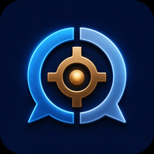
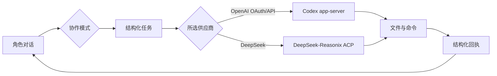

<p align="center">
  
</p>

<h1 align="center">HSR Partner Harness</h1>

<p align="center">把角色对话和本地 AI 编程放进同一个 Windows 工作台</p>

<p align="center">
  <a href="https://github.com/Jonah-Wu23/HSR_Partner_Harness/releases"></a>
  <a href="https://github.com/Jonah-Wu23/HSR_Partner_Harness/actions/workflows/ci.yml"></a>
  
  <a href="LICENSE"></a>
  <a href="https://jonah-wu23.github.io/HSR_Partner_Harness/"></a>
</p>

<p align="center">
  <a href="README.en.md">English</a> ·
  <a href="https://jonah-wu23.github.io/HSR_Partner_Harness/">项目介绍网站</a> ·
  <a href="https://github.com/Jonah-Wu23/HSR_Partner_Harness/releases">下载 Windows x64</a> ·
  <a href="docs/architecture.md">架构说明</a>
</p>

HSR Partner Harness 是一个 Windows 桌面应用。你可以先和白厄讨论项目，确定任务后把它交给神秘的古代机械，执行过程和结果会回到同一条会话里，白厄也能继续根据结果交流。

项目把讨论和任务执行放在一个工作区里，结果也会留在会话中。它适合个人开发，也适合研究原型和角色型产品创作。

## 产品定位

HSR Partner Harness 面向本地项目工作流，适合以下场景：

| 使用者 | 适合的工作方式 |
| --- | --- |
| 个人开发者 | 在对话中说明目标，让编程助手进入项目文件夹完成任务。 |
| 研究与原型团队 | 保留完整任务上下文，方便复盘实验过程。 |
| 角色型产品创作者 | 用角色对话承接需求，再把明确任务交给可执行的编程助手。 |

当前版本聚焦本地 Windows 工作流，模型请求按你的配置发往相应服务商。

## 项目质量门

GitHub Actions 在 Windows runner 执行 Python 测试、前端测试与构建、Rust 格式检查和测试。PR 会触发依赖审查，CodeQL 负责 Python 与 TypeScript 检查。

## 核心特色

| 能力 | 说明 |
| --- | --- |
| 一条会话，两条工作轨 | 聊天模式专注角色对话；协作模式打开助手工作台，任务运行期间也能继续聊天。 |
| 统一模型供应商 | 引导页或设置选择 OpenAI OAuth/API 时，角色和古代机械都使用 GPT；选择 DeepSeek 时，两者都使用 DeepSeek。 |
| 任务过程可见 | OpenAI 配置通过 Codex app-server 执行，DeepSeek 配置通过随包的 DeepSeek-Reasonix ACP 执行；工具事件以结构化卡片显示。 |
| 项目文件夹绑定 | 一个项目对应一个本地文件夹，名称默认取文件夹名，也支持随时重选路径。Python Sidecar 管理会话状态，SQLite 保存本地数据。 |
| 语音与思考通道 | 角色回复支持 DashScope ASR/TTS；思考内容和工具记录各自显示，工具记录保持静音。 |
| 可先体验再配置 | demo 模式提供完整界面与交互体验，写入模型配置后即可切换真实运行。 |

| 界面档位 | API effort |
| --- | --- |
| 轻度 | `low` |
| 中 | `medium` |
| 高 | `high` |
| 极高 | `xhigh` |
| 最高 | `max` |

## v0.2.5 更新

- 本地账号和设置中心，按账号保存各项模型与语音设置，并管理 Codex 登录信息。
- 持久化会话队列支持调整任务内容与顺序，也可撤回任务；当前回合结束后自动派发。
- DeepSeek 角色与古代机械共用同一供应商配置；结构化输出分成思考和正文两条流，技术详情保留原始 JSON。
- Sidecar 提供连接状态和自动重连，断线期间已加载的界面继续可用。
- Windows NSIS 安装包随带 Python Sidecar，并内置 Codex 与 VAD 资源。

## 工作方式



角色负责交流和任务委派，助手负责文件操作与命令执行。消息按来源归位，工具记录单独显示。

界面细节和交互走查见[项目介绍网站](https://jonah-wu23.github.io/HSR_Partner_Harness/)。

## 下载与快速体验

Windows x64 安装包在 [GitHub Releases](https://github.com/Jonah-Wu23/HSR_Partner_Harness/releases)。首次安装可能触发 Windows SmartScreen 提醒。

安装后可直接进入 demo 模式体验界面和交互。配置模型后即可运行真实编程功能：OpenAI 配置使用随包 Codex，DeepSeek 配置使用随包 DeepSeek-Reasonix。

```powershell
codex --version
```

OpenAI 配置默认使用随包 Codex，DeepSeek 配置默认使用随包 Reasonix；从源码运行时，也可以通过 `PAIR_HARNESS_CODEX_BIN` 和 `PAIR_HARNESS_REASONIX_BIN` 指定路径。

## 真实模式配置

复制 [.env.example](.env.example) 到配置文件，再填入模型服务信息。源码运行时默认读取仓库根目录的 `.env`，安装版默认读取 `%LOCALAPPDATA%\PairHarness\.env`。需要使用其他位置时，设置 `PAIR_HARNESS_ENV_FILE`。

| 变量 | 用途 |
| --- | --- |
| `PAIR_HARNESS_DIALOGUE_BASE_URL` | 对话模型的 OpenAI 兼容地址。 |
| `PAIR_HARNESS_DIALOGUE_API_KEY` | 对话模型密钥。 |
| `PAIR_HARNESS_DIALOGUE_MODEL` | 对话模型名称。 |
| `PAIR_HARNESS_CODEX_BIN` | 覆盖 Codex 可执行文件路径。 |
| `DASHSCOPE_API_KEY` | DashScope 语音密钥。 |
| `PAIR_HARNESS_DASHSCOPE_HOST` | DashScope 工作空间域名。 |

角色声音 ID 写在 [phainon_ancient_machine.yaml](config/pairs/phainon_ancient_machine.yaml) 中。使用自己的 DashScope 账号时，需要替换成该账号可用的声音。

找到配置文件时，应用默认进入真实模式。也可以用 `PAIR_HARNESS_REAL=1` 强制真实模式，或用 `PAIR_HARNESS_DEMO=1` 强制 demo 模式。

## 从源码运行

开发环境需要 Python 3.11，桌面构建需要 Node.js 22 和 Rust stable。

```powershell
python -m venv .venv
.\.venv\Scripts\python.exe -m pip install -e ".[voice,dev]"

Set-Location desktop
npm install
npm run build:sidecar
npm run tauri:dev
```

发布构建会把 Windows 原生 Codex app-server 和 DeepSeek-Reasonix 复制进安装包。构建机需要准备 `@openai/codex` 与 `reasonix`，或分别设置 `PAIR_HARNESS_CODEX_NATIVE_ROOT`、`PAIR_HARNESS_REASONIX_NATIVE_ROOT`：

```powershell
npm install -g @openai/codex
npm install -g reasonix
Set-Location desktop
npm run tauri:build
```

安装包位于 `desktop/src-tauri/target/release/bundle/nsis/`。直接运行的 GUI 位于 `desktop/src-tauri/target/release/hsr-partner-harness.exe`。启动时默认隐藏控制台；调试 Sidecar 时可运行 `hsr-partner-harness.exe --debug-console`，`--console` 也可使用。

## 测试与发布验证

当前 v0.2.5 已完成以下验证：

| 检查项 | 结果 |
| --- | --- |
| Python | `413 passed, 5 skipped` |
| 前端 Vitest | `103 passed` |
| TypeScript | `tsc --noEmit` 通过 |
| Rust | `cargo test`，`7 passed` |
| 生产构建 | Vite build 通过 |
| Windows 安装包 | NSIS `HSR Partner Harness_0.2.5_x64-setup.exe` 构建通过，Sidecar、Codex、Reasonix 与 VAD 资源已随包封装 |

常用命令：

```powershell
# Python
.\.venv\Scripts\python.exe -m pytest -q

# 前端
Set-Location desktop
npm test -- --run
npm run typecheck
npm run build

# Rust
Set-Location desktop\src-tauri
cargo test
```

## 仓库结构与文档

| 路径 | 内容 |
| --- | --- |
| `desktop/` | Tauri 2 桌面端和 React 界面。 |
| `src/pair_harness/` | Python Sidecar 和业务代码。 |
| `config/` | 搭档配置和提示词。 |
| `assets/` | 运行时模型文件。 |
| `tests/` | Python 测试。 |
| `docs/architecture.md` | 桌面架构说明。 |
| `docs/design/v0.2.5-release-notes.md` | v0.2.5 发布说明。 |

## 参与项目

欢迎通过 [Issues](https://github.com/Jonah-Wu23/HSR_Partner_Harness/issues) 提交问题和使用反馈。修改代码前，请先阅读 [AGENTS.md](AGENTS.md) 以及相关设计文档，优先保持 Python Sidecar 的业务权威和现有桌面架构。

## 外部代码与许可

`src/pair_harness/config/providers.py` 中的供应商识别方式和推理档位语义参考了 [DeepSeek-Reasonix](https://github.com/esengine/deepseek-reasonix)，原项目使用 MIT License，完整声明在 [THIRD_PARTY_NOTICES.md](THIRD_PARTY_NOTICES.md)。

编程助手接入 [OpenAI Codex](https://github.com/openai/codex)，通过本机 Codex app-server 执行文件和命令。

代码采用 [Apache License 2.0](LICENSE)，版权所有 © 2026 Zonghe Wu。

本项目为同人创作，角色名称和世界观相关内容归原权利人所有。
