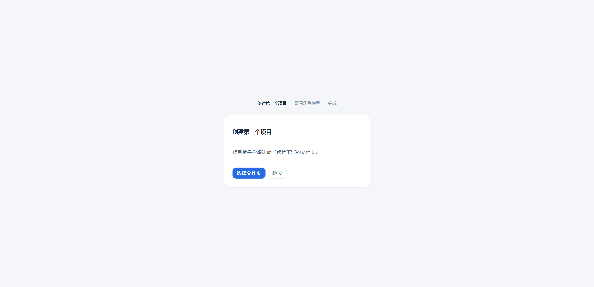
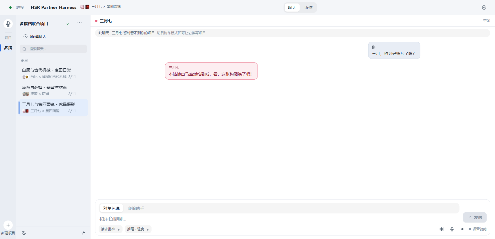
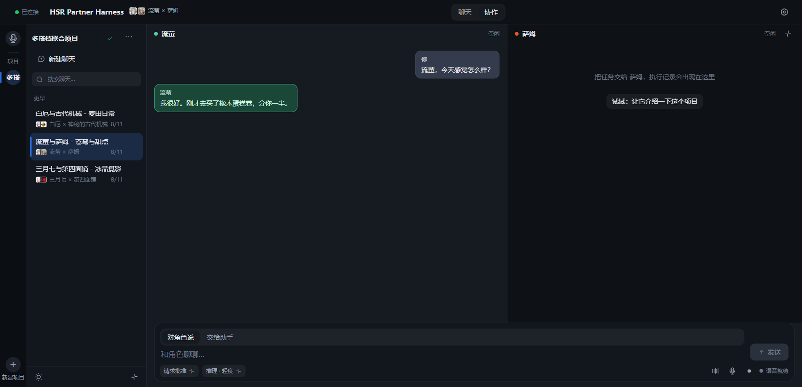
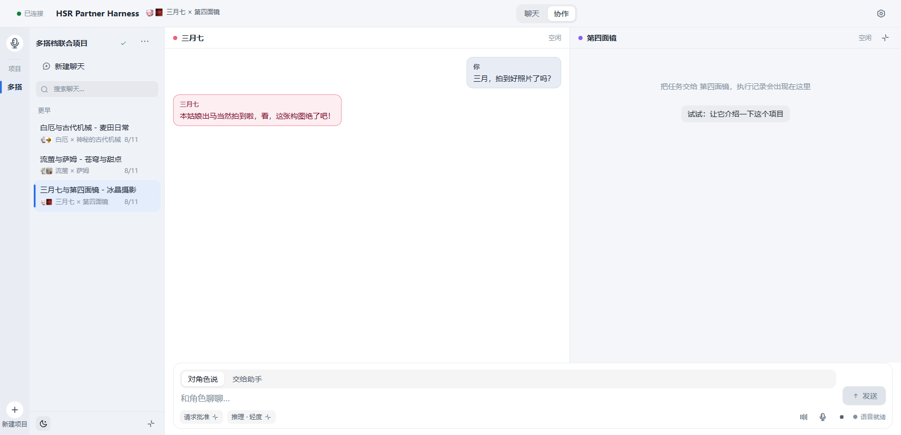
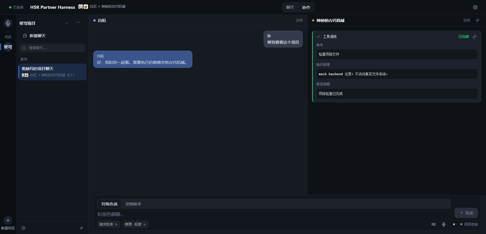
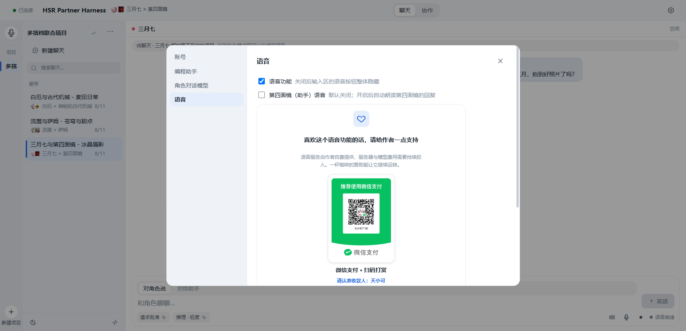

<p align="center">
  
</p>

<h1 align="center">HSR Partner Harness</h1>

<p align="center">一条会话，两条工作轨。</p>

<p align="center">
  <a href="https://github.com/Jonah-Wu23/HSR_Partner_Harness/releases"></a>
  <a href="https://github.com/Jonah-Wu23/HSR_Partner_Harness/actions/workflows/ci.yml"></a>
  
  <a href="LICENSE"></a>
  <a href="https://jonah-wu23.github.io/HSR_Partner_Harness/"></a>
</p>

<p align="center">
  <a href="README.en.md">English</a> ·
  <a href="https://jonah-wu23.github.io/HSR_Partner_Harness/">项目介绍网站</a> ·
  <a href="https://github.com/Jonah-Wu23/HSR_Partner_Harness/releases">Windows x64 下载</a> ·
  <a href="docs/architecture_V0.2.0.md">架构说明</a>
</p>

HSR Partner Harness 将角色扮演对话与本地 AI 编程整合至同一个 Windows 工作台。在会话中与角色讨论需求后，任务可直接委派给助手，在绑定的本地项目目录中执行。对话上下文全程保持连贯，执行状态与产出结果在同一条时间线呈现。

角色空间保障交流连续，助手空间负责文件读写与命令执行。任务委派具备清晰来源标记，执行结果同步回传至对话上下文。

## 一条会话，两条工作轨

聊天模式专注角色交流，协作模式展开助手工作台。模式切换时上下文保持连贯，角色能够结合执行结果继续对话。

| 产品特点 | 具体表现 |
| --- | --- |
| 任务过程可见 | 工具调用与执行状态显示在助手工作台。 |
| 搭档随会话切换 | 头像与界面主题跟随当前会话的搭档配置。 |
| 项目文件夹绑定 | 助手在绑定的本地项目目录中读写文件并执行命令。 |
| 角色专属语音 | DashScope 语音音色按照当前搭档配置加载。 |

## 使用说明

### 创建项目

首次启动时选择本地项目文件夹。应用使用文件夹名称创建项目，后续可在项目栏更改名称或重新选择路径。



### 开始对话

聊天模式由当前角色参与对话，适合整理需求或查看历史消息。每条会话独立保存所选搭档，切换会话时会同步更新头像与界面主题。



### 选择搭档

新建聊天时可从搭档目录选择角色组合。v0.3.0 提供以下搭档：

| 角色 | 助手 |
| --- | --- |
| 白厄 | 神秘的古代机械 |
| 流萤 | 萨姆 |
| 三月七 | 第四面镜 |



浅色主题根据当前搭档使用对应的界面配色。



### 执行任务

协作模式在角色对话区旁呈现助手工作台。在输入区勾选“交给助手”后发送任务，工具调用与执行结果将以结构化卡片展示。



### 设置语音

语音设置页用于启用 DashScope 语音服务，也可设置自动朗读与 VAD。音色跟随当前会话的搭档切换，自然语言回复接入自动朗读通道。



以上截图取自内置预览场景，用于说明操作位置与界面状态。完成模型配置后可运行真实协作任务。

## 工作模式

| 模式 | 用途 |
| --- | --- |
| 聊天模式 | 界面集中呈现角色对话。 |
| 协作模式 | 角色参与当前会话，助手接收结构化任务并操作项目文件。 |

角色消息与助手消息保留各自的来源标记。命令及工具事件使用独立卡片显示。

## 模型接入

OpenAI 配置通过内置 Codex app-server 执行任务。DeepSeek 配置通过 DeepSeek-Reasonix ACP 执行任务，角色模型与助手模型共用当前供应商设置。

推理档位与 API effort 的对应关系如下：

| 界面档位 | API effort |
| --- | --- |
| 轻度 | `low` |
| 中 | `medium` |
| 高 | `high` |
| 极高 | `xhigh` |
| 最高 | `max` |

语音功能采用 DashScope 服务，自然语言回复接入自动朗读通道。

## 安装

Windows x64 安装包发布于 [GitHub Releases](https://github.com/Jonah-Wu23/HSR_Partner_Harness/releases)。安装后可使用内置预览模式查看界面交互，配置模型后即可运行真实任务。

安装版默认读取 `%LOCALAPPDATA%\PairHarness\.env`。源码运行默认读取仓库根目录的 `.env`，可通过 `PAIR_HARNESS_ENV_FILE` 自定义配置文件路径。

## 配置

复制 [.env.example](.env.example) 为 `.env` 并填写对应服务配置：

| 变量 | 用途 |
| --- | --- |
| `PAIR_HARNESS_DIALOGUE_BASE_URL` | 对话模型的 OpenAI 兼容地址。 |
| `PAIR_HARNESS_DIALOGUE_API_KEY` | 对话模型密钥。 |
| `PAIR_HARNESS_DIALOGUE_MODEL` | 对话模型名称。 |
| `PAIR_HARNESS_CODEX_BIN` | Codex 可执行文件路径。 |
| `DASHSCOPE_API_KEY` | DashScope 语音密钥。 |
| `PAIR_HARNESS_DASHSCOPE_HOST` | DashScope 工作空间域名。 |

搭档资料与音色 ID 位于 `config/pairs/*.yaml`。自定义 DashScope 账号需要填入当前账号支持的音色 ID。

通过环境变量 `PAIR_HARNESS_REAL=1` 启用真实模式，`PAIR_HARNESS_DEMO=1` 启用预览模式。

## 从源码运行

环境要求：Python 3.11，桌面端构建依赖 Node.js 22 与 Rust stable。

```powershell
python -m venv .venv
.\.venv\Scripts\python.exe -m pip install -e ".[voice,dev]"

Set-Location desktop
npm install
npm run build:sidecar
npm run tauri:dev
```

发布构建会将 Windows 原生 Codex app-server 与 DeepSeek-Reasonix 打包入安装程序。构建环境可全局安装依赖，也可通过 `PAIR_HARNESS_CODEX_NATIVE_ROOT` 与 `PAIR_HARNESS_REASONIX_NATIVE_ROOT` 指定路径。

```powershell
npm install -g @openai/codex
npm install -g reasonix
Set-Location desktop
npm run tauri:build
```

NSIS 安装包生成于 `desktop/src-tauri/target/release/bundle/nsis/`。编译后的可执行程序位于 `desktop/src-tauri/target/release/hsr-partner-harness.exe`。

## 验证结果

v0.3.0 当前源码已完成以下验证：

| 检查项 | 结果 |
| --- | --- |
| Python | `420 passed, 5 skipped` |
| 前端 Vitest | `107 passed` |
| TypeScript | `tsc --noEmit` 通过 |
| Rust | `cargo test`，`7 passed` |
| 前端生产构建 | Vite build 通过 |
| DeepSeek 真实链路 | 2 项测试通过 |
| Codex app-server | 文件检查任务完成，收到 `turn.completed` 事件 |

常用验证命令：

```powershell
# Python
.\.venv\Scripts\python.exe -m pytest -q

# 前端
Set-Location desktop
npm test -- --run
npm run typecheck
npm run build

# Rust
Set-Location desktop\src-tauri
cargo test
```

## 仓库结构

| 路径 | 内容 |
| --- | --- |
| `desktop/` | Tauri 2 桌面端与 React 界面。 |
| `src/pair_harness/` | Python Sidecar 与业务代码。 |
| `config/` | 搭档配置与提示词。 |
| `assets/` | 桌面应用运行时资源。 |
| `tests/` | Python 测试。 |
| `docs/` | 架构资料与项目介绍网站。 |

Python Sidecar 管理业务状态，桌面端通过 JSONL 协议与其通信。本地持久化数据存储于 SQLite。

## 项目支持

语音服务由项目作者持续提供。自愿支持项目可使用下方二维码。

<p align="center">
  
</p>

## 参与项目

问题与使用反馈可提交至 [Issues](https://github.com/Jonah-Wu23/HSR_Partner_Harness/issues)。修改代码前请阅读 [AGENTS.md](AGENTS.md) 及相关设计文档，业务状态以 Python Sidecar 为准。

## 外部代码与许可

`src/pair_harness/config/providers.py` 的供应商识别方式与推理档位语义参考 [DeepSeek-Reasonix](https://github.com/esengine/deepseek-reasonix)。原项目采用 MIT License，完整声明见 [THIRD_PARTY_NOTICES.md](THIRD_PARTY_NOTICES.md)。

编程助手通过本机 [OpenAI Codex](https://github.com/openai/codex) app-server 执行文件操作与命令。

代码采用 [Apache License 2.0](LICENSE)，版权所有 © 2026 Zonghe Wu。

本项目为同人创作，角色名称与世界观相关内容归原权利人所有。
