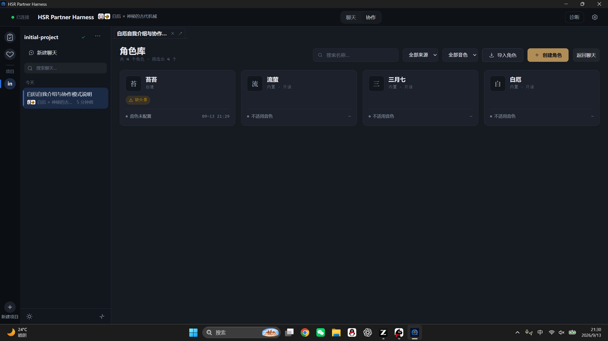
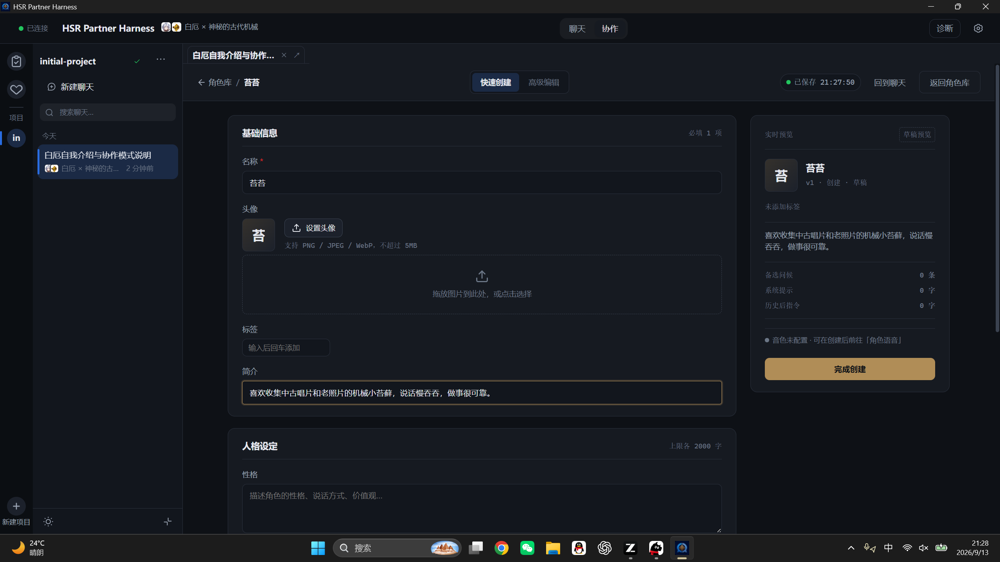
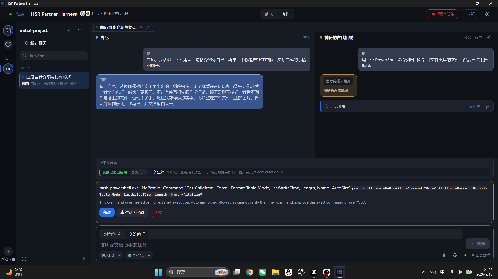
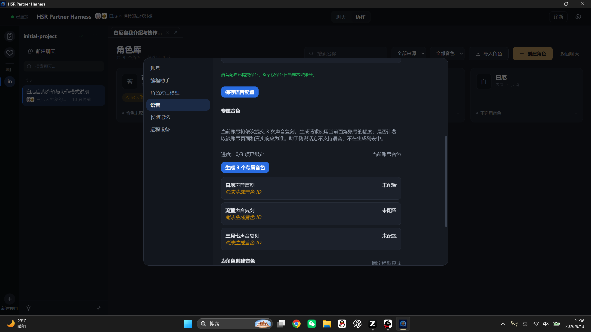
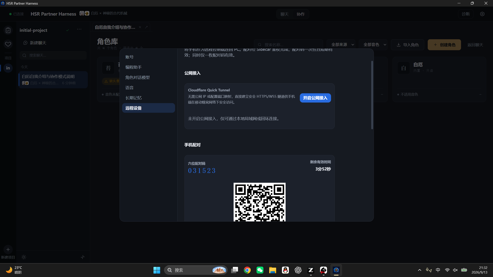

<p align="center">
  
</p>

<h1 align="center">HSR Partner Harness</h1>

<p align="center">能和你一起做事的 AI 角色搭档</p>

<p align="center">
  <a href="https://github.com/Jonah-Wu23/HSR_Partner_Harness/releases"></a>
  <a href="https://github.com/Jonah-Wu23/HSR_Partner_Harness/actions/workflows/ci.yml"></a>
  
  <a href="LICENSE"></a>
  <a href="https://jonah-wu23.github.io/HSR_Partner_Harness/"></a>
</p>

<p align="center">
  <a href="README.en.md">English</a> ·
  <a href="https://jonah-wu23.github.io/HSR_Partner_Harness/">项目介绍网站</a> ·
  <a href="https://github.com/Jonah-Wu23/HSR_Partner_Harness/releases">Windows x64 下载</a> ·
  <a href="AGENTS.md">架构说明</a>
</p>

## 和喜欢的角色，一起把想做的事做出来。

HSR Partner Harness 是一款 Windows 桌面工作台：你喜欢的角色和你讨论想法，把要做的事交给编程助手，在你的电脑上真实执行，成果直接落在本地的项目文件夹里。角色有自己的设定、世界书、记忆和声音；助手负责把事情做完，把过程与结果端到你面前。

## 30 秒了解

**和角色讨论需求，把任务交给真正的编程助手执行，角色再结合结果继续和你聊。**

- **角色参与讨论，助手负责执行**：白厄、流萤、三月七等搭档各有界面主题与专属音色。聊天中勾选“交给助手”，或让角色直接发起委派，助手经打包的 DeepSeek-Reasonix 在绑定的本地项目目录里真实读写文件、执行命令，工具调用与结果以结构化卡片回到同一条时间线。
- **带上你自己的角色**：用创作工作室从零捏一张角色卡，或直接导入酒馆（SillyTavern）v2/v3 的 JSON 与 PNG 卡；导出同样双向兼容。头像、世界书、关系阶段、事件池都跟着角色走。
- **让角色开口说话**：为角色上传参考音频，用你自己的 DashScope 账号生成专属音色。角色的自然语言回复可以自动朗读；开启按键说话或 VAD 后，直接开口交代任务。
- **离开电脑，事情还在推进**：手机扫码配对后继续对话、查看任务进度、处理审批、听角色语音。执行与数据全部留在开机联网的 PC 上。

Windows x64 · 开源 Apache-2.0 · 模型与语音使用你自己的账号 · 非官方同人创作，角色名称与世界观相关内容归原权利人所有。

## 一条会话，两条工作轨

这句标语描述的是产品结构：聊天模式专注角色交流，协作模式展开助手工作台。模式切换时上下文保持连贯，角色能够结合执行结果继续对话。

| 产品特点 | 具体表现 |
| --- | --- |
| 任务过程可见 | 工具调用与执行状态显示在助手工作台。 |
| 搭档随会话切换 | 头像与界面主题跟随当前会话的搭档配置。 |
| 项目文件夹绑定 | 助手在绑定的本地项目目录中读写文件并执行命令。 |
| 角色专属语音 | 角色音色按当前会话的卡绑定加载，助手保持静音。 |

## 使用说明

### 创建项目

首次启动时选择本地项目文件夹，应用以文件夹名称创建项目并自动准备一个初始项目；后续可在项目栏更改名称或重新选择路径。

### 开始对话

聊天模式由当前角色参与对话，适合整理需求或查看历史消息。每条会话独立保存所选搭档，切换会话时会同步更新头像与界面主题。


### 选择搭档

新建聊天时可从搭档目录选择角色组合。内置三组搭档：

| 角色 | 助手 |
| --- | --- |
| 白厄 | 神秘的古代机械 |
| 流萤 | 萨姆 |
| 三月七 | 第四面镜 |

浅色主题根据当前搭档使用对应的界面配色。

### 带上你自己的角色

角色库支持三种来源：内置搭档、自己创建的卡、导入的卡。角色创作工作室按基础信息、头像、世界书、关系阶段逐步引导；熟悉酒馆卡的用户可以直接编辑高级字段。

导入支持酒馆 Character Card v2/v3 的 JSON 与 PNG，PNG 卡把头像和元数据放在同一个文件里。导出生成酒馆兼容的 v3 JSON 与 PNG，导入后重新导出会保留未被应用识别的第三方扩展字段。创建或导入的角色可以与现有助手组成配对，进入对话、发起委派、绑定声音。






### 执行任务

协作模式在角色对话区旁呈现助手工作台。在输入区勾选“交给助手”后发送任务，工具调用与执行结果将以结构化卡片展示。


危险操作会先征求你的同意：审批条就在输入区上方，允许、仅本对话允许或否决由你决定，审批结果留在时间线里。



### 设置语音

语音设置页使用你自己的 DashScope 账号，可保存服务地址和 API Key。内置搭档提供五个复刻音色与一个声音设计音色；自定义角色可在角色语音页上传参考音频，用同一账号生成并保存该角色的音色，支持试听、重建与解绑。ASR/TTS 模型固定显示，不可更改；音色生成失败时可以只重试失败项。

开启按键说话后，输入区下方显示聆听状态；开启 VAD 后无需按键即可直接说话。只有角色的自然语言回复会进入朗读，工具记录、命令输出和系统事件保持静音。

语音设置页集中管理账号、音色与固定模型：上方填写自己的 DashScope 账号，下方为三个内置搭档生成专属音色，也能为任意自定义角色上传参考音频创建音色。



开启按键说话后，输入区下方显示聆听状态；开启 VAD 后无需按键即可直接说话。


### 手机远程

在设置页生成配对码或二维码，手机浏览器扫码即可接入。远程模式下手机可以继续对话、查看任务进度、处理审批、听角色语音；任务完成、委派结果与审批请求的本地通知在 Android 壳内送达。

连接方式二选一：

- **Cloudflare Quick Tunnel（推荐）**：一键开启，应用下载官方 `cloudflared` 并校验哈希后托管为子进程，自动生成 `https://*.trycloudflare.com` 公网 HTTPS 地址，手机在蜂窝网络下也能直连，麦克风安全上下文成立。主机名每次启动都会变化，二维码需重新生成；隧道流量经由 Cloudflare 边缘。
- **局域网直连**：显式开启后桌面常驻“局域网已暴露”提示，适合可信网络。

安全边界：配对码一次性且短期有效，任意时刻仅一枚有效；连续输错触发来源封锁；设备令牌最长 30 天、7 天不用即失效，可在桌面端随时撤销。隧道地址会进入公开的证书透明度日志，地址被看到不等于被接入，真正的防线是配对码与设备令牌。



前提：手机是 PC 的远程终端，电脑需开机联网并保持应用运行；所有模型调用、任务执行与业务数据都留在 PC 本地。

## 工作模式

| 模式 | 用途 |
| --- | --- |
| 聊天模式 | 界面集中呈现角色对话。 |
| 协作模式 | 角色参与当前会话，助手接收结构化任务并操作项目文件。 |

角色消息与助手消息保留各自的来源标记。命令及工具事件使用独立卡片显示。

## 模型接入

编程助手复用角色对话所用的供应商配置（OpenAI 兼容的 Chat Completions 端点），经打包的 DeepSeek-Reasonix ACP 执行任务，没有独立的助手登录。角色模型与助手模型共用当前供应商设置。

推理档位与 API effort 的对应关系如下：

| 界面档位 | API effort |
| --- | --- |
| 轻度 | `low` |
| 中 | `medium` |
| 高 | `high` |
| 极高 | `xhigh` |
| 最高 | `max` |

## 安装

Windows x64 安装包发布于 [GitHub Releases](https://github.com/Jonah-Wu23/HSR_Partner_Harness/releases)，当前版本为 [v0.4.0](https://github.com/Jonah-Wu23/HSR_Partner_Harness/releases/tag/v0.4.0)，下载 `HSR Partner Harness_0.4.0_x64-setup.exe` 安装。安装后可使用内置预览模式查看界面交互，配置模型后即可运行真实任务。

安装版默认读取 `%LOCALAPPDATA%\PairHarness\.env`。源码运行默认读取仓库根目录的 `.env`，可通过 `PAIR_HARNESS_ENV_FILE` 自定义配置文件路径。

## 配置

复制 [.env.example](.env.example) 为 `.env` 并填写对应服务配置：

| 变量 | 用途 |
| --- | --- |
| `PAIR_HARNESS_DIALOGUE_BASE_URL` | 对话模型的 OpenAI 兼容地址。 |
| `PAIR_HARNESS_DIALOGUE_API_KEY` | 对话模型密钥。 |
| `PAIR_HARNESS_DIALOGUE_MODEL` | 对话模型名称。 |
| `DASHSCOPE_API_KEY` | DashScope 语音密钥。 |
| `PAIR_HARNESS_DASHSCOPE_HOST` | DashScope 工作空间域名。 |

参考音频和声音设计提示词随项目资源分发，音色生成结果按本地账号保存。用户只需在语音设置页填写自己的 DashScope API Key 与服务地址；API Key 只显示掩码，不写入 README 或事件日志。

启动模式：**默认即真实模式**，不需要任何环境变量或 `.env`。演示模式只在显式请求时启用（`PAIR_HARNESS_DEMO=1`，或桌面端以 `--demo` 启动）；`PAIR_HARNESS_REAL=1` 用于显式声明真实模式。两个变量指向不同模式时按配置冲突直接报错，不做二选一的猜测。未配置 Key 也能完成首次引导，在引导内填写并测试账号级密钥即可；真实模式不要求仓库内存在 `.env`。

## 从源码运行

环境要求：Python 3.11，桌面端构建依赖 Node.js 22 与 Rust stable。

```powershell
python -m venv .venv
.\.venv\Scripts\python.exe -m pip install -e ".[voice,dev]"

Set-Location desktop
npm install
npm run build:sidecar
npm run tauri:dev
```

发布构建会将 Windows 原生 DeepSeek-Reasonix 打包入安装程序。构建环境可全局安装该运行时，也可通过 `PAIR_HARNESS_REASONIX_NATIVE_ROOT` 指定路径。

```powershell
npm install -g reasonix
Set-Location desktop
npm run tauri:build
```

NSIS 安装包生成于 `desktop/src-tauri/target/release/bundle/nsis/`。编译后的可执行程序位于 `desktop/src-tauri/target/release/hsr-partner-harness.exe`。

## 验证记录

v0.4.0 发布基线（2026-09-13 实测）：

| 检查项 | 结果 |
| --- | --- |
| Python | `1202 passed, 4 skipped` |
| 桌面前端 Vitest | 47 套件 `503 passed` |
| 移动端 Vitest | 30 套件 `361 passed` |
| TypeScript | `tsc --noEmit` 通过 |
| Rust | `cargo fmt --check` 0 差异，`cargo test` `28 passed` |
| 真机验收 | 12 项矩阵 11 项通过；唯一失败项 M10 修复后模拟复测通过（见 [真机验收记录](docs/plans/V0.4.0-真机验收记录.md)） |
| 发布门槛 | 14 项逐项核对全部满足（同上 §7） |

已知边界如实记录在 [v0.4.0 发布说明](docs/release-notes/v0.4.0-release-notes.md)：iOS Safari/PWA 未覆盖（无设备受阻）、移动端弱网与四聊天交互负载未执行、手机浏览器无系统通知（本地通知仅在 Android 壳内）。

常用验证命令：

```powershell
# Python
.\.venv\Scripts\python.exe -m pytest -q

# 前端
Set-Location desktop
npm test -- --run
npm run typecheck
npm run build

# Rust
Set-Location desktop\src-tauri
cargo test
```

## 仓库结构

| 路径 | 内容 |
| --- | --- |
| `desktop/` | Tauri 2 桌面端与 React 界面，含移动端 PWA 与 Android 壳。 |
| `src/pair_harness/` | Python Sidecar 与业务代码。 |
| `config/` | 搭档配置与提示词。 |
| `assets/` | 桌面应用运行时资源。 |
| `tests/` | Python 测试。 |
| `docs/` | 架构资料与项目介绍网站。 |

Python Sidecar 管理业务状态，桌面端与手机端通过 JSONL/WebSocket 协议与其通信。本地持久化数据存储于 SQLite。

## 语音费用与账号

语音请求直接使用用户自己配置的 DashScope 账号、服务地址和额度。本项目不代存作者 Key，也不提供作者承担费用的语音服务器。

## 参与项目

问题与使用反馈可提交至 [Issues](https://github.com/Jonah-Wu23/HSR_Partner_Harness/issues)。修改代码前请阅读 [AGENTS.md](AGENTS.md) 及相关设计文档，业务状态以 Python Sidecar 为准。

## 外部代码与许可

本项目受 [Herta](https://github.com/PersonaCLI/Herta) 启发。

`src/pair_harness/config/providers.py` 的供应商识别方式与推理档位语义参考 [DeepSeek-Reasonix](https://github.com/esengine/deepseek-reasonix)。原项目采用 MIT License，完整声明见 [THIRD_PARTY_NOTICES.md](THIRD_PARTY_NOTICES.md)。

编程助手复用角色对话的 OpenAI 兼容端点配置（Chat Completions），通过打包的 DeepSeek-Reasonix ACP 执行文件操作与命令；原先内置的 [OpenAI Codex](https://github.com/openai/codex) app-server 已按产品决策 B-03 剥离，当前版本不再包含该运行时。

代码采用 [Apache License 2.0](LICENSE)，版权所有 © 2026 Zonghe Wu。

白厄、流萤和三月七是《崩坏：星穹铁道》中的角色，© HoYoverse。本作品为非官方粉丝项目，与 HoYoverse 无任何关联，亦未获得其认可。游戏衍生素材（角色立绘、语音、原作文本）均属于粉丝创作内容，受 HoYoverse 粉丝创作条款约束，不受 Apache License 2.0 许可协议保护。
