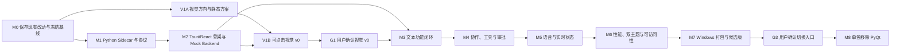

# Tauri + React 桌面迁移双 AI 详细实施计划

- 日期：2026-08-11
- 状态：待实施
- 总体设计：`docs/specs/2026-08-11-tauri-react-python-sidecar-design.md`
- 目标仓库：`E:\AI\HSR Partner Harness`
- 迁移范围：Tauri 2 + React + TypeScript 前端，Python Sidecar 保留现有业务能力
- 协作角色：强逻辑 AI、强视觉 AI

## 0. 计划目标

本计划把桌面迁移拆成两条并行工作流：

- 强逻辑 AI 保证功能和状态闭环，并负责最终打包。
- 强视觉 AI 决定用户看到与操作到的界面，并负责视觉质量和交互手感。

迁移完成后，现有功能和运行规则保持不变，完整范围见第 15 节。前端换成更适合精细设计的 React 界面，窗口由 Tauri 承载，Python 继续承担业务逻辑。

两位 AI 通过稳定的 UI ViewModel 和动作接口协作。强视觉 AI 可以先用假数据完成高保真界面，强逻辑 AI 可以同时实现 Sidecar 和 Tauri 桥接。双方不同时修改同一组文件。

## 1. 实施总原则

1. 当前工作区存在用户尚未提交的 PyQt 与语音改动。任何迁移工作开始前都要先确认这些改动已经由原负责人保存，禁止清理、覆盖或重置。
2. 原项目 `E:\AI\二次元情感陪伴助手` 继续只读。
3. 迁移先保持功能等价，再切换默认桌面入口；PyQt 界面在完整验收前保留。
4. 项目按本地单用户 MVP 实施，不扩展生产级治理、插件市场或多 Agent 产品架构。
5. 一个阶段只解决该阶段列出的目标。阶段完成后分别提交，禁止混入无关改动。
6. 强逻辑 AI 是最终集成负责人。强视觉 AI 对最终视觉效果拥有决定权，涉及功能语义的调整必须交回强逻辑 AI。
7. 浅色和深色都要达到交付质量。默认深色继续遵守 `AGENTS.md`，主题选择保持持久化。

## 2. 双 AI 职责划分

### 2.1 强逻辑 AI

负责：

- 盘点并冻结现有功能行为。
- 抽取无界面的 Python Application Service。
- 设计和实现 stdin/stdout JSONL 协议。
- 实现 Tauri Rust Core、Python Sidecar 生命周期与错误转发。
- 管理项目、聊天、消息、工具、审批、语音和任务状态。
- 生成 React 使用的类型、ViewModel、动作接口与假数据驱动器。
- 实现 Zustand 状态层、事件归并、跨聊天路由和重连恢复。
- 维护构建配置、依赖清单、自动化测试和 Windows 打包。
- 合并视觉分支，解决集成冲突，执行最终功能回归。

强逻辑 AI 不自行改造视觉方案。组件缺少字段或状态时，先补充 UI 契约，再由强视觉 AI调整可见实现。

### 2.2 强视觉 AI

负责：

- 提出 HSR Partner Harness 专属的视觉论点和设计系统。
- 为左侧项目与聊天导航提出至少两种高质量方案。
- 设计浅色、深色两个完整主题。
- 完成主窗口、聊天模式、协作模式、工具卡片、审批区和语音状态的可见界面。
- 设计流式回复、任务状态、等待反馈、菜单与弹层的交互细节。
- 完成键盘焦点、空状态、错误状态、禁用状态和长内容适配。
- 建立本地图标库，只复制实际使用的 Kimi Design Skill SVG 资产。
- 使用批准后的假数据制作可点击 v0，并在真实集成后做视觉复核。
- 维护视觉快照和双主题验收截图。

强视觉 AI 不修改 Python、Rust、IPC、数据库、Zustand 业务状态或打包配置。需要新字段、动作或依赖时，把请求交给强逻辑 AI。

### 2.3 用户负责的确认点

用户只需要在三个门槛作决定：

1. 视觉 v0：确认整体风格、左侧导航方案和双主题方向。
2. 文本闭环：确认项目切换、聊天和协作模式的操作路径。
3. 最终候选版：确认可以切换默认入口，并决定何时移除 PyQt。

## 3. 文件所有权

计划采用以下目录结构：

```text
E:\AI\HSR Partner Harness
├─ src/pair_harness/
│  ├─ core/                         # 现有业务核心
│  ├─ adapters/                     # 现有模型与 Codex 适配器
│  ├─ storage/                      # 现有 SQLite
│  ├─ core/voice_runtime.py          # 现有语音运行时
│  └─ desktop_backend/              # 新增 Python Sidecar
├─ desktop/
│  ├─ package.json
│  ├─ vite.config.ts
│  ├─ src-tauri/                    # Rust Core
│  └─ src/
│     ├─ app/                       # 启动与集成容器
│     ├─ contracts/                 # 生成类型与 UI 契约
│     ├─ services/                  # Tauri/Mock Backend
│     ├─ stores/                    # Zustand 状态
│     ├─ presenters/                # Store 到 ViewModel 映射
│     ├─ mocks/                     # 可预测的视觉假数据
│     ├─ ui/                        # 可见组件
│     ├─ styles/                    # 视觉令牌与主题
│     └─ assets/icons/              # 项目本地图标库
└─ tests/
```

| 路径 | 唯一修改者 | 说明 |
|---|---|---|
| `src/pair_harness/core/**` | 强逻辑 AI | 仅做迁移必需的小范围抽取 |
| `src/pair_harness/adapters/**` | 强逻辑 AI | 现有模型与 CodingEngine 接线 |
| `src/pair_harness/storage/**` | 强逻辑 AI | 数据库路径与语义保持不变 |
| `src/pair_harness/desktop_backend/**` | 强逻辑 AI | Sidecar 协议和应用服务 |
| `desktop/src-tauri/**` | 强逻辑 AI | 进程、IPC、窗口与打包 |
| `desktop/package.json`、构建配置 | 强逻辑 AI | 视觉 AI 通过交接请求依赖 |
| `desktop/src/contracts/**` | 强逻辑 AI | 前端可消费的稳定契约 |
| `desktop/src/services/**` | 强逻辑 AI | 真实和假 Backend |
| `desktop/src/stores/**` | 强逻辑 AI | 业务状态投影 |
| `desktop/src/presenters/**` | 强逻辑 AI | 为 UI 生成 ViewModel |
| `desktop/src/mocks/**` | 强逻辑 AI | 覆盖视觉所需全部状态 |
| `desktop/src/app/**` | 强逻辑 AI | 组合真实状态与视觉根组件 |
| `desktop/src/ui/**` | 强视觉 AI | 可见组件与交互 |
| `desktop/src/styles/**` | 强视觉 AI | 浅色、深色和组件令牌 |
| `desktop/src/assets/icons/**` | 强视觉 AI | 统一图标出口与选定 SVG |
| React 视觉测试与快照 | 强视觉 AI | 用户确认后冻结基准 |
| Python、Rust、协议与集成测试 | 强逻辑 AI | 最终回归门槛 |

共有文件始终只有一位写入者。另一位需要改动时，通过交接说明提出具体需求，由文件所有者完成。

## 4. UI 契约与交接方式

### 4.1 UI 契约

强逻辑 AI 在 `desktop/src/contracts/view-models.ts` 提供稳定接口。首批 ViewModel：

- `AppShellViewModel`
- `NavigationViewModel`
- `WorkspaceViewModel`
- `ConversationTimelineViewModel`
- `AssistantWorkbenchViewModel`
- `ComposerViewModel`
- `ApprovalViewModel`
- `VoiceViewModel`

动作集中在 `desktop/src/contracts/actions.ts`：

- `createProject`
- `selectProject`
- `createConversation`
- `selectConversation`
- `renameConversation`
- `archiveConversation`
- `switchMode`
- `switchTheme`
- `submitMessage`
- `cancelTask`
- `resolveApproval`
- `setApprovalMode`
- `setReasoningEffort`
- `startPushToTalk`
- `stopPushToTalk`
- `stopSpeech`

视觉组件只接收 ViewModel 与动作回调。组件不直接读取 SQLite，不调用 Tauri `invoke`，也不解析 Sidecar 事件。

### 4.2 假数据场景

强逻辑 AI 在 `desktop/src/mocks/scenarios.ts` 至少提供：

- 新安装空状态。
- 一个项目和一个聊天。
- 多项目、多聊天和长标题。
- 路径失效项目。
- 聊天模式中的角色流式回复。
- 协作模式中的角色、助手和工具卡片。
- 运行中、成功、失败、取消的任务。
- 三种审批模式及待审批队列。
- VAD、PTT、ASR 临时文本和 TTS 播放状态。
- 深色与浅色主题。
- 500 条消息的性能场景。

视觉 AI 可以切换场景，不需要等待真实 Python 后端。

### 4.3 每次交接内容

每次交接只需包含：

- 基线提交与本次提交 SHA。
- 修改文件列表。
- 已覆盖的状态和仍缺少的状态。
- 本地运行命令。
- 关键截图或短录屏路径。
- 需要另一位 AI 处理的接口、字段或视觉问题。

禁止用长篇解释代替可运行提交。

## 5. 技能使用安排

### 5.1 强视觉 AI 必须使用

开始 V1 前完整读取并应用：

- `ui-ux-pro-max`：先生成 AI chatbot desktop app 的设计系统，再检索导航、双主题、流式聊天和可访问性。
- `frontend-design`：提出一句视觉论点，并检查方案是否具有本项目识别度。
- `frontend-skill`：检查主工作区、导航和辅助上下文的层级，清理无意义卡片。
- `web-design-engineer`：声明视觉系统，先交付可查看 v0，完整实现后按清单自检。
- Kimi Design Skill：读取 `principles.md`、`tokens.json`、Web 组件、页面布局、动效和图标规范；按需读取 Button、Menu、Toggle、Segmented Control、Toast、Tooltip、Modal、Dialog 与 Form。
- `web-design-guidelines`：代码完成后拉取最新规则，审查 React UI 文件。

Kimi Design Skill 的本机入口：

`C:\Users\JonahWu\AppData\Roaming\kimi-desktop\daimon-share\daimon\skills\kimi-design-skill\SKILL.md`

设计阶段可以参考该目录，成品不能依赖该绝对路径。使用到的 SVG 需要复制到仓库并通过项目图标组件导入。

### 5.2 强逻辑 AI 必须使用

- `vercel-react-best-practices`：重点落实直接导入、重型模块懒加载、细粒度状态订阅、稳定回调和长列表渲染。
- `ui-ux-pro-max` React 栈规则：长列表虚拟化、批量状态更新和性能分析。
- `web-design-guidelines`：配合强视觉 AI 修复语义、键盘、焦点和动态内容通知问题。

## 6. 阶段与依赖



M1 与 V1A 可以并行。V1B 需要 M2 提供最小 React 容器和假数据接口；真实模型联调不阻塞视觉探索。

## 7. M0：保存当前工作与冻结功能基线

### 强逻辑 AI

1. 读取 `git status --short`，记录所有用户改动和未跟踪文件。
2. 等待当前 PyQt/语音改动由原负责人提交或明确保存方式。
3. 使用项目虚拟环境运行现有测试：

```powershell
.\.venv\Scripts\python.exe -m pytest -q
```

4. 建立功能等价清单，记录当前入口和关键操作路径。
5. 在工作区干净后创建迁移分支与两个独立 worktree。建议：

```text
codex/tauri-logic
codex/tauri-visual
```

### 强视觉 AI

1. 阅读当前 PyQt 界面和已有截图，只提取功能、信息层级与品牌色。
2. 不把当前 QSS 布局当成 React 视觉模板。
3. 整理左侧导航、聊天区、助手区、输入区和审批区的现有可见功能。

### 验收

- 用户改动全部保留。
- Python 测试基线已记录。
- 两个 AI 使用不同 worktree。
- 功能等价清单包含第 15 节全部项目。

### 建议提交

`chore: freeze desktop migration baseline`

## 8. M1：Python Application Service 与 Sidecar 协议

负责人：强逻辑 AI。

### 任务

1. 从 `src/pair_harness/ui/app.py` 抽取不依赖 Qt 的应用装配与命令入口。
2. 新建 `src/pair_harness/desktop_backend/`：

```text
desktop_backend/
├─ __init__.py
├─ application_service.py
├─ commands.py
├─ events.py
├─ protocol.py
├─ router.py
└─ __main__.py
```

3. 复用现有 Orchestrator、SQLiteStore、DialogueModel、CodingEngine 和 VoiceRuntime。
4. stdout 只写一行一个 JSON 对象；诊断文字全部写 stderr。
5. 实现设计文档定义的 request、response、event 三类消息。
6. 事件序号在 Sidecar 出口单调递增。前端发现缺号后调用 `app.bootstrap` 获取快照。
7. `message.delta` 在 Python 或前端入口按 30 至 50 ms 合并，不能为每个 token 触发完整 React 状态更新。
8. `app.shutdown` 等待正在落库的状态，最长 2 秒后退出。
9. 从 Pydantic 模型导出 JSON Schema，并生成受版本控制的 TypeScript 协议类型。

### 测试文件

- `tests/unit/test_desktop_protocol.py`
- `tests/unit/test_application_service.py`
- `tests/integration/test_desktop_sidecar_loop.py`

### 验收

- 可以从 PowerShell 启动 Sidecar，收到 `backend.ready`。
- `app.bootstrap` 返回项目、聊天、消息、工具、任务、审批和语音快照。
- 坏 JSON 只产生可识别错误，后续合法请求仍可处理。
- stdout 无日志污染。
- 原 PyQt 入口继续可用。

### 建议提交

`feat: add headless desktop application service`

## 9. M2：Tauri、React 骨架与假 Backend

负责人：强逻辑 AI。强视觉 AI 在骨架提交后开始 V1。

### 强逻辑 AI 任务

1. 新建 `desktop/`，配置 React、TypeScript、Vite 与 Tauri 2。
2. Rust Core 只负责窗口、原生文件夹选择、Sidecar 生命周期和消息转发。
3. 实现 `DesktopBackend` 接口：

```ts
interface DesktopBackend {
  request<T>(command: DesktopCommand): Promise<T>;
  subscribe(listener: (event: DesktopEvent) => void): () => void;
}
```

4. 提供 `TauriDesktopBackend` 和 `MockDesktopBackend`。
5. 建立 Zustand store，按 `message_id`、`tool_call_id` 和 `conversation_id` 归并事件。
6. 建立第 4.2 节列出的假数据场景。
7. `AppController` 把 store 映射成 ViewModel，再传给强视觉 AI 的根组件。
8. 首次绘制前读取持久化主题，设置根节点 `data-theme`。

### Rust 测试

- Sidecar 启动后正确转发 `backend.ready`。
- stdin 写入失败时返回明确错误。
- Sidecar 异常退出时发送断开事件。
- 应用关闭时执行 `app.shutdown`。

### React 测试

- 协议事件归并到正确聊天。
- 工具卡片按 `tool_call_id` 更新原记录。
- 切换聊天不移动活动任务归属。
- 主题初始化不出现错误主题中间帧。

### 验收

- `npm run dev` 可在浏览器 Mock 模式打开。
- `npm run tauri dev` 可启动空壳并连接测试 Sidecar。
- 强视觉 AI 无需 Python 即可切换全部假数据场景。

### 建议提交

`feat: scaffold Tauri React desktop shell`

## 10. V1：视觉系统、左侧导航与可点击 v0

负责人：强视觉 AI。此阶段不接真实后端。

### 任务

1. 按第 5.1 节使用全部视觉与前端设计技能。
2. 提出一句视觉论点，说明角色陪伴与编程协作如何同时出现。
3. 建立语义令牌，至少覆盖：

- 浅色、深色背景和文本层级。
- 角色、助手和系统身份。
- 成功、警告、失败、运行和审批状态。
- 间距、字号、圆角、阴影和动效曲线。

4. 为左侧项目与聊天导航制作至少两种方案。视觉 AI 自行决定具体布局，不受现有 PyQt 树形控件约束。
5. 制作高保真 v0，包含：

- 浅色主题主窗口。
- 深色主题主窗口。
- 聊天模式。
- 协作模式。
- 审批区展开。
- 多项目、多聊天和运行中任务。
- 路径失效与空状态。

6. 使用 Mock Backend 完成可点击交互。
7. 从 Kimi 图标资产中复制实际使用的 SVG，统一封装成 React 图标组件。
8. 在 `desktop/src/ui/**` 与 `desktop/src/styles/**` 内实现，不改业务 store。

### v0 评审画面

- 1180×760，覆盖当前默认窗口尺寸。
- 1440×900，检查常用桌面布局。
- 1920×1080，检查大屏密度。
- 两种主题各一组。

### 验收

- 用户确认一种左侧导航方案。
- 用户确认整体风格和双主题方向。
- 切换主题、聊天和模式的操作无需解释。
- 常用按钮响应立即，动效不拖慢连续操作。
- 没有通用 SaaS 卡片拼盘或营销落地页结构。

### 建议提交

`feat: add approved AI-native desktop visual system`

## 11. M3：项目、聊天与纯文本闭环

负责人：强逻辑 AI 集成，强视觉 AI 负责可见组件。

### 强逻辑 AI

1. 接通 `app.bootstrap`、`project.*`、`conversation.*` 与 `chat.submit`。
2. 保持一个项目绑定一个文件夹、一个项目包含多个聊天的现有语义。
3. 恢复聊天时同步消息、工具卡片、模式、搭档和引擎会话引用。
4. 基线中已经存在的日常聊天数据与入口按原语义迁移。基线尚未实现时，继续留在原计划阶段，不借界面迁移提前加入。
5. 用 TanStack Virtual 渲染超过阈值的项目、聊天和消息列表。
6. 只在用户接近底部时跟随流式消息；用户向上浏览时显示回到最新入口。

### 强视觉 AI

1. 完成已批准的左侧导航。
2. 完成消息气泡、Markdown、代码块、思考折叠和回到最新入口。
3. 完成 Kimi 风格参考下的菜单、Tooltip、Toast 和主题切换控件。
4. 长标题、长消息、空状态和路径失效状态保持完整布局。

### 自动化场景

- 新建项目并选取文件夹。
- 在当前项目中新建聊天。
- 切换项目与聊天。
- 关闭后重新打开，恢复当前聊天。
- 聊天模式发送给角色并接收流式回复。
- 切换双主题并重新启动，主题保持不变。

### G2 用户确认

用户实际操作文本闭环，确认左侧导航、输入区和聊天切换顺手。未确认前不进入工具与审批的完整视觉集成。

### 建议提交

- 强逻辑 AI：`feat: connect project conversation and chat flow`
- 强视觉 AI：`feat: finish navigation and conversation experience`

## 12. M4：协作模式、工具卡片、审批与取消

### 强逻辑 AI

1. 接通 `task.busy_changed`、工具事件、审批事件和 `task.cancel`。
2. 保持整个应用最多一个编程 turn。
3. 用户切到其他聊天时，任务事件继续写回发起聊天。
4. 用户在运行中直接交给助手的新指令继续走 amendment 路由。
5. 三种审批模式保持现有语义与项目级持久化。
6. 审批处理后立即锁定按钮，收到最终事件后收起。
7. 工具记录按 `tool_call_id` 原位更新，最终状态落库。

### 强视觉 AI

1. 完成角色区与助手工作台的双栏布局及拖动分栏。
2. 工具卡片默认显示摘要、类型和状态，命令、路径与输出放在展开区。
3. 助手自然语言与工具输出保持清楚区别。
4. 审批区固定在输入区上方，出现时不遮挡输入内容，也不引发大范围布局跳动。
5. 运行、成功、失败和取消状态在两种主题下都清楚。
6. 思考内容默认折叠，代码与日志不使用逐行入场动画。

### 自动化场景

- 角色委派任务，角色接受台词先出现。
- 工具卡片从运行中更新到成功。
- 工具失败后显示原因与助手总结。
- 请求批准模式依次测试允许、本对话内允许和否决。
- 帮我审核模式显示静音裁决卡片。
- 完全允许运行模式不出现审批按钮。
- 取消当前任务。
- 任务运行中发送 amendment。

### 建议提交

- 强逻辑 AI：`feat: connect collaboration task and approval events`
- 强视觉 AI：`feat: finish assistant workbench and approval interactions`

## 13. M5：语音闭环

### 强逻辑 AI

1. 接通 VAD 开关、PTT 开始、PTT 结束与停止朗读命令。
2. ASR 只发送临时文字和最终文字，不跨 IPC 传输原始音频。
3. TTS 继续只朗读角色与助手面向用户的自然语言。
4. 命令、路径、日志、工具参数、代码块、审批和系统状态保持静音。
5. 窗口失焦时自动结束 PTT。
6. 聊天切换后 VoiceRuntime 使用当前聊天和搭档上下文。

### 强视觉 AI

1. 设计待机、监听、识别、处理中、播放和错误状态。
2. ASR 临时文字稳定出现在输入区，不导致工具栏位置变化。
3. PTT 按下、保持和松开的反馈清楚。
4. TTS 播放提供停止入口，状态变化迅速。
5. 动画只表达音频状态，不持续占据视觉中心。

### 验收

- 测试适配器完整跑通。
- 有真实 DashScope 配置时运行现有 ASR/TTS 联调；没有配置时不阻塞迁移主线。
- 工具与系统内容没有进入 TTS。

### 建议提交

- 强逻辑 AI：`feat: bridge desktop voice runtime`
- 强视觉 AI：`feat: add responsive voice interaction states`

## 14. M6：恢复、错误、性能与可访问性

### 强逻辑 AI

1. 实现事件序号缺口检测与 `app.bootstrap` 重建。
2. Sidecar 断开时保留当前可见状态和输入草稿，提供重启后恢复。
3. Zustand 只订阅组件实际需要的字段；高频流式状态使用细粒度选择器。
4. Shiki 按需初始化，Monaco 只有进入对应视图时才加载。
5. 直接导入实际模块，避免大范围 barrel import。
6. 500 条消息使用虚拟列表，滚动时不创建整棵消息 DOM。
7. 运行 React Profiler 和浏览器 Performance 录制，先定位再优化。

### 强视觉 AI

1. 完成启动、加载、空、断开、重连和局部错误状态。
2. 检查键盘顺序、焦点恢复、菜单 Escape、弹层焦点锁定和图标按钮名称。
3. 为动态状态使用合适的 `aria-live`，避免流式 token 逐个打断屏幕阅读器。
4. 执行浅色和深色视觉检查，正文对比度达到 WCAG AA。
5. 执行 `prefers-reduced-motion` 检查。
6. 使用最新 `web-design-guidelines` 审查所有 UI 文件，并修复高优先级问题。

### 性能验收

- 应用窗口先出现可操作外壳，后端初始化不会冻结窗口。
- 输入文字、切换聊天和展开卡片没有可感知阻塞。
- `message.delta` 在一个合并周期内上屏。
- 500 条消息滚动稳定，历史列表不一次渲染全部 DOM。
- 用户查看历史时，新消息不抢走滚动位置。
- 双主题切换不重建业务状态，不出现错误主题闪屏。
- 高频操作不使用长动画；常规操作目标为 60 fps。

### 验证命令

```powershell
Set-Location -LiteralPath 'E:\AI\HSR Partner Harness'
.\.venv\Scripts\python.exe -m pytest -q
.\.venv\Scripts\python.exe -m compileall -q src

Set-Location -LiteralPath 'E:\AI\HSR Partner Harness\desktop'
npm run typecheck
npm run test
npm run build
npm run test:e2e
cargo test --manifest-path .\src-tauri\Cargo.toml
```

### 建议提交

- 强逻辑 AI：`perf: stabilize desktop streaming and recovery`
- 强视觉 AI：`fix: complete desktop accessibility and theme polish`

## 15. 现有功能等价清单

以下每项都必须在 React/Tauri 中找到等价入口和验证证据：

| 功能 | 迁移要求 |
|---|---|
| 深浅主题切换 | 即时切换、持久化、默认深色、两种主题完整 |
| 项目创建 | 原生文件夹选择，项目绑定文件夹 |
| 项目切换 | 当前聊天、审批模式和上下文同步切换 |
| 多聊天 | 新建、选择、保存和恢复 |
| 固定搭档 | 聊天与搭档关系不串线 |
| 日常聊天 | 基线已经实现时原样迁移；尚未实现时不提前加入 |
| 聊天模式 | 全宽角色对话，不调用工具 |
| 协作模式 | 角色区与助手区双栏，分栏可调 |
| 默认发送给角色 | 文字、VAD 和 PTT 保持现有规则 |
| 直接交给助手 | 文字和 PTT，运行中走 amendment |
| 角色委派 | 只有结构化任务进入助手执行 |
| 工具记录 | 结构化、可展开、按调用原位更新 |
| 单一活动 turn | 全应用只运行一个编程 turn |
| 任务取消 | 取消按钮与最终状态一致 |
| 三种审批模式 | 请求批准、帮我审核、完全允许运行 |
| 推理档位 | 项目或聊天现有语义保持 |
| ASR | 使用既定 Qwen 流式模型 |
| TTS | 使用既定 Qwen TTS，只朗读自然语言 |
| 静音边界 | 命令、路径、日志、代码和状态不朗读 |
| SQLite | 继续使用现有数据库与历史数据 |
| 路径失效 | 左侧导航中明确提示 |
| 流式消息 | 角色、助手和工具状态持续更新 |
| 思考内容 | 默认折叠，用户可展开 |

当前尚未完成的其他搭档内容和外部服务条件不因界面迁移自动扩展。迁移只保证已有能力不退化。

## 16. M7：Windows 打包与候选版

负责人：强逻辑 AI 集成，强视觉 AI 复核成品。

### 强逻辑 AI

1. 使用 PyInstaller `onedir` 打包 Python Sidecar，避免 `onefile` 每次启动解压。
2. 将 Sidecar 按 Tauri external binary 要求命名并写入 `externalBin`。
3. 打包现有配置、提示词、VAD 模型和运行必需资源。
4. Vite 静态资源嵌入 Tauri，不依赖外部浏览器或本地 Web 服务器。
5. 数据库继续使用 `%LOCALAPPDATA%\PairHarness\pair_harness.db`。
6. 打包候选版只允许一个应用实例访问该数据库。
7. 首个目标为 Windows x64，先生成可安装候选包。

### 强视觉 AI

1. 完成应用图标、窗口标题区和启动状态的视觉收尾。
2. 在打包后的 WebView2 中复查字体、缩放、阴影和弹层位置。
3. 复查 100%、125%、150% Windows 缩放比例。
4. 输出最终浅色、深色截图和主要操作短录屏。

### 候选版验收

- 新机器安装后可启动，不依赖开发目录。
- Sidecar 能启动并正确退出，无残留进程。
- 项目、聊天和主题可以恢复。
- 文本、任务、审批和语音测试适配器闭环通过。
- 有真实服务配置时，现有真实适配器链路可以运行。
- 安装包内不包含无关开发资源和整个 Kimi Skill 目录。

### 建议提交

`build: package Tauri desktop candidate`

## 17. M8：切换入口与移除 PyQt

本阶段必须等待用户确认候选版。

### 第一步：切换默认入口

- 默认桌面启动方式改为 Tauri 应用。
- PyQt 入口保留为临时回退。
- 再运行一轮第 15 节功能等价测试。

建议提交：`chore: make Tauri the default desktop entry`

### 第二步：单独移除 PyQt

只有用户明确同意后才执行：

- 删除 `src/pair_harness/ui/**` 中只属于 PyQt 的代码。
- 移除 PyQt5、qasync 和 pytest-qt 依赖。
- 删除已经被 React 测试替代的 Qt UI 测试。
- 保留 Python 核心、适配器、存储和语音测试。

建议提交：`refactor: remove superseded PyQt desktop UI`

两个步骤必须分开提交，便于在候选期保留清晰回退点。

## 18. 合并与提交规则

1. 强视觉 AI 从强逻辑 AI 的骨架提交创建视觉分支。
2. 强视觉 AI 每个提交只修改视觉所有权目录。
3. 强逻辑 AI 审查接口使用和功能状态，不替换已确认视觉方案。
4. 强逻辑 AI 把视觉提交合入逻辑分支，完成真实接线。
5. 强视觉 AI 在集成版本上做最终视觉复核，修正只回到视觉目录。
6. 每次提交只添加本次涉及文件，不使用 `git add -A`。
7. 合并前双方各自运行所属测试；强逻辑 AI 最后运行完整命令集。

## 19. 明确不进入本次迁移

- 3D、MMD、换装、相册和 WebGL 角色资源。
- Electron、移动端和多窗口。
- 云同步、自动更新、崩溃上报和遥测平台。
- 自定义 MCP 网关、工具市场和插件系统。
- 将 Python 业务逻辑重写为 Rust。
- 借迁移机会重做数据库语义或清空历史数据。
- 未经确认扩展新的角色搭档内容。
- 完整 IDE 文件浏览器和代码编辑器。

## 20. 完成定义

只有同时满足以下条件，迁移才算完成：

1. 第 15 节功能等价清单全部通过。
2. 强视觉 AI 的 v0 已经由用户确认，最终成品与确认方向一致。
3. 左侧项目与聊天导航在常见数据量下美观、清楚、顺手。
4. 浅色和深色都通过视觉、对比度与状态覆盖检查。
5. 500 条消息、流式回复和工具更新保持顺滑。
6. Python、React、Rust 与端到端测试全部通过。
7. Windows x64 候选包可以独立安装和运行。
8. 用户确认 Tauri 可以成为默认入口。
