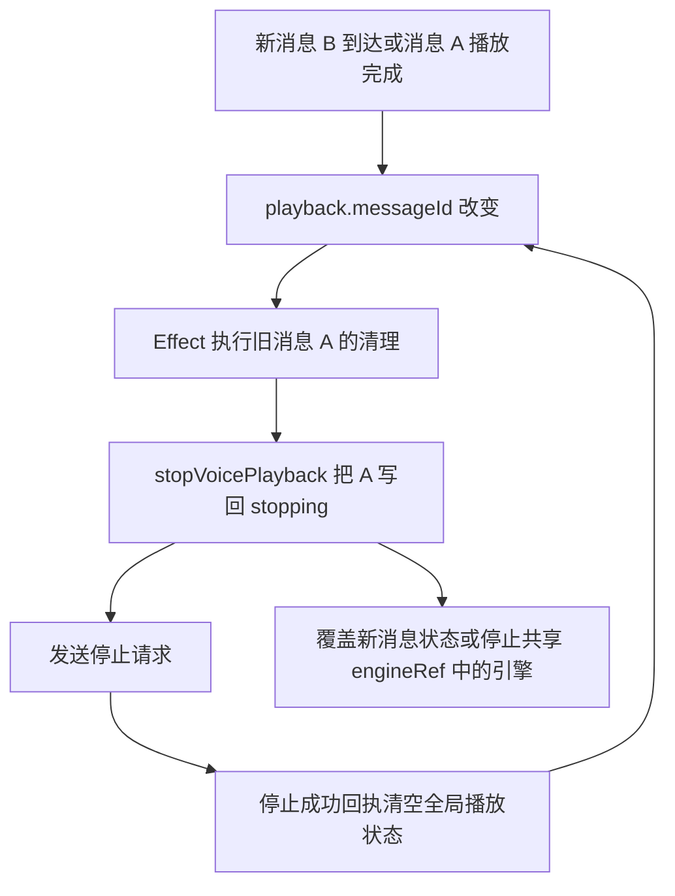

# V0.3.8 真机与桌面端诊断报告

日期：2026-09-06。结论：**真机验证未通过，尚不具备提交推送、创建 PR 和合并的准入条件。**

本轮只分析原因并编写报告。依据为用户提供的《V0.3.8 真机与桌面端调试事实记录日志》、本地原始留痕、当前工作树和框架官方文档；没有实施代码修复，也没有重新执行真机测试。文中的测试通过数均来自本次验收留存日志。

## 1. 判定依据与适用范围

三个已观察到的问题分别足以阻断验收：

1. **手机语音播放后界面失去响应**，需要强制停止应用才能恢复。
2. **手机远程控制时，电脑与手机同时发声**，违反本次用户明确要求。
3. **锁屏返回出现白屏，Activity 重建后仍无法操作**，恢复流程未达到可用状态。

自动化测试通过、短句确实发出声音、委派确实创建文件，都只能证明各自覆盖的部分。它们不能抵消上述真机失败。

诊断对象是 `v0.3.8-fixes` 分支的未提交工作树。诊断时 HEAD 为 `d433359f1ce0c6a9ddd941bc10493908a33c9779`，其中已有多处 V0.3.8 代码和测试改动；不能把本次结果描述成该 HEAD 提交本身已经通过验收。移动端 `package.json` 仍标为 `0.3.7`，因此后续应以候选源码、构建日志和实际安装产物共同标识验证版本。

判断分为三类：**已证实**指原始记录或代码直接支持；**高可信解释**指代码机制与观测吻合、尚缺现场调用栈等最终证据；**待验证**指还不能确定是否在本次发生。旧计划中的根因描述不自动视为本轮诊断结论。

## 2. 验收矩阵

| 项目 | 本次已证明的能力或失败 | 判定 | 剩余条件 |
| --- | --- | --- | --- |
| C1 后台保活与通知 | 后台系统中存在 `phm_task_completed_default` 通道通知，前台服务为 `isForeground=true` | 部分通过 | 锁屏期间新增事件投递、通知去重及返回后的数据一致性仍需补证 |
| C2 语音与连续对话 | 短句有声；长回复及短句场景出现无响应；停止响应大量重复 | **未通过** | 连续完整播放、操作响应、播放状态收尾必须同时通过 |
| 远程播放设备互斥 | 手机远程触发后，两端扬声器同时出声 | **未通过** | 手机控制期间，电脑端应用语音输出为零 |
| C3 消息队列 | 手机置顶、编辑、撤回生效；桌面命令及快照反映变更 | 已执行主路径通过 | 当前回合失败、取消后的真实队列推进与双端提示仍需补证 |
| C4 委派与审批 | 手机批准后实际产生文件；工具为 `succeeded`，相关 turn 为 `completed` | 已执行真实主路径通过 | 拒绝、取消、审批超时和供应商异常路径仍需补证；本次不能证明所有引擎均通过 |
| C5 壳层稳定 | 20 次短暂前后台切换有响应；锁屏返回白屏，恢复后仍不可操作 | **未通过** | 满足原计划“前后台至少 20 次、播放至少 10 条”，并验证锁屏和恢复后的真实操作 |
| C6 会话与模式 | 普通消息提交后 `last_mode=chat`；缺省创建调用产生新会话 | 部分通过；“重复会话”归因需更正 | 按冻结契约复测“使用该角色”入口；补桌面实际交互证据 |
| 工程检查 | mobile 235 项、desktop 349 项、Python 828 项、Rust 15 项通过；类型检查和前端构建通过 | 所记录检查通过 | Python 有 4 skipped、1 warning；离线检查不能替代真机结果 |

## 3. 统一因果分析

### D1：播放状态发生循环回写，是无响应的首要解释

**影响：阻断 C2。代码缺陷已确认；它导致本次停止请求风暴的解释具有高可信度。WebView 主线程具体阻塞位置尚未取到现场调用栈。**

原始 `sidecar.log` 大小为 **297,813,949 字节**。按 JSON 逐行统计，筛选 `kind=response`、`result.stopped=true` 且存在 `result.message_id` 的响应，共 **1,792,415 条**。服务端当前只有 `_voice_mobile_tts_stop` 返回这一组合，见 `application_service.py:3420–3428`。这是停止命令的响应行数，不能解释为语音播放次数、用户点击次数或供应商重试次数。

| 消息 ID 尾部或完整 ID | 停止响应数 | 首次出现的日志行 |
| --- | ---: | ---: |
| `91cd4426-3e30-4bf4-822a-fa4f146bf478` | 298,871 | 481 |
| `feda8c43-6739-4df5-b181-efc1be299b0c` | 287,375 | 482 |
| `c453877c-4469-42bc-959a-0349bd8813b4` | 465,509 | 587,964 |
| `8377e249-5cb1-493a-8da4-93f7a7390e7c` | 447,604 | 587,965 |
| `357e996b-472c-4835-b09f-ab72539a5106` | 161,721 | 1,501,250 |
| `0ff3196d-9526-418b-8322-581f926c4a86` | 131,335 | 1,526,489 |

最早一组响应在两个消息 ID 间交替，请求 ID 从 `m-11`、`m-12` 持续增加；后续批次也有同样形态。这与下面的状态回写路径吻合：

- `voicePlayback.ts:348–358` 的清理 Effect 依赖 `playback.messageId`，清理时调用捕获的旧 ID 对应的 `stopVoicePlayback`。**消息 ID 改变就会执行清理**；源码注释把它理解成仅卸载清理，范围不准确。React 官方明确说明，依赖改变时会先使用旧值执行清理。[React useEffect 文档](https://react.dev/reference/react/useEffect#parameters)
- `mobileStore.ts:1248–1273` 的停止 action 立即把传入 ID 写成全局 `stopping`；响应成功后无条件将全局播放状态清为 `idle/null`。这里没有检查当前状态是否已属于另一条消息，也没有绑定该次播放实例。
- `mobileStore.ts:691–790` 的 chunk/end 事件也会更新同一个全局 `playback.messageId`。`voicePlayback.ts:296–346` 的单个 `engineRef` 没有记录其所属消息，函数参数 `_conversationId` 也未参与隔离。
- 服务端为每条可朗读消息独立建立合成任务，见 `application_service.py:3469–3476`；相邻回复的语音流能够重叠，前端因此确实需要面对消息 A/B 交替到达。

典型时序如下，箭头表示代码允许的状态变化；是否每一步单独提交渲染，取决于现场调度：

这条路径同时解释了旧 ID 复活、多个 ID 交替停止、新播放被旧回执清空，以及播放结束后的持续请求。高频状态更新和网络响应处理可以拖慢页面，并向恢复探活施加压力；CPU、内存和渲染进程是否同时异常，仍需要现场性能记录确认。

**“短句也卡死”需要保留实验条件。** 单句“愿今天的旅途平安顺利。”在日志第 1,526,358 行生成，之前从第 1,501,250 行起，委派结果消息 `357e996b…` 已经出现重复停止响应。该短句场景并非没有旧播放状态干扰的独立实验，不能据此推导“任意短句都会单独触发原生音频崩溃”。它仍然证明当时的应用无法正常完成语音交互。

旧计划把 C2 直接归因于强制 24 kHz AudioContext。本轮代码已改为共享的默认采样率 AudioContext，原生日志也有 48 kHz 输出记录。采样率、OEM 音频实现、自动播放限制、内存压力可以保留为后续排查项，现有证据不支持继续把其中任何一项写成此次唯一根因。

### D2：桌面与手机各自播放，缺少设备互斥控制

**影响：独立阻断项。双端发声是现场事实，双路独立执行是代码已证实的原因。**

同一条角色消息进入两条执行路径：

| 路径 | 代码证据 | 实际输出 |
| --- | --- | --- |
| 桌面本地 | `application_service.py:665–668` 注册 `VoiceRuntime.on_message`；`voice_runtime.py:421–480` 将消息入队；`:583–603` 调播放器 | `voice_factory.py:154` 装配本机 `AudioPlayer(sample_rate=24_000)` |
| 手机远程 | `application_service.py:4673` 调 `_maybe_relay_mobile_tts`，`:3438–3449` 检查远程订阅和消息来源，再独立合成 | `:3573` 下发手机 PCM；手机播放引擎连接 `ctx.destination` |

桌面入队条件检查会话、搭档和消息来源，未判断手机是否正在控制。手机路径检测到远程订阅后开始下发，也未撤销桌面播放资格。`remote_only=True` 只限定事件扇出范围，不会使本机 `AudioPlayer` 静音。

手机的 `voice.mobile_tts_stop` 仅清理手机合成条目和任务，也不会停止桌面播放器。修好手机状态循环后，双端发声仍会存在，必须作为独立问题验收。

用户本次已经明确的产品约束是：**手机处于远程控制状态时，电脑端不得发声，不能以双端同时播放作为正常行为。** 后续实现前应把播放归属、接管及释放时机写入契约。原生通知连接和 WebView 连接属于同一设备的不同通道，不能直接以 socket 数量决定播放归属。

建议后续采用的验收口径：手机控制期间，电脑端本应用的自动朗读及已排队语音均保持静音；手机播放失败、短暂断线或切后台时，也不能未经接管流程就在电脑继续朗读。手机能否在后台继续播放是另一项能力，不改变此处的电脑静音要求。退出远程控制后，桌面恢复播放的时机需要在契约中明确并单独验证。

### D3：锁屏返回无响应，现有重建路径未恢复可用页面

**影响：阻断 C5。白屏和恢复失败已证实；初始卡顿与 D1 的关联、重建失败的底层原因仍需分开取证。**

`mobile-logcat-locked.log:731` 在 11:00:24.118 记录的是：`WebView 探活超时（4000ms 无回调），重建 Activity 恢复`，随后有 Activity relaunch。`mobile-locked-return.png` 显示应用内容区域为空白。

这段日志没有直接证明 `onRenderProcessGone` 被调用，也没有给出 `didCrash=true`。因此，事实汇总中“捕获到渲染异常”的表述应细化为“探活超时触发重建”。不能把探活无回调等同于已证实的渲染进程崩溃。

当前恢复机制存在三个需要验证的环节：

1. **探活含义过强。** `MainActivity.kt:90–110` 通过 `evaluateJavascript("1")` 等待回调，4 秒超时即 `recreate()`。页面忙于处理 D1 的状态和响应循环、唤醒尚未完成或渲染进程退出，都可能表现为无回调；该判断尚不能区分它们。
2. **Activity 重建与 Tauri/Wry 内容恢复未得到验证。** 本地 Wry 0.55.1 `android/main_pipe.rs:487–497` 和 Tao 0.35.3 `ndk_glue.rs:678–693` 在 `isChangingConfigurations=false` 时会销毁 WebView/窗口相关状态。必须记录本次 `recreate()` 的该标记及其后的 WebView 创建、资源加载、JS 启动和 bootstrap 结果，才能确定是否走到了无法恢复原窗口的路径。当前不能仅凭调用 `recreate()` 宣布恢复成功。
3. **真正进程退出时的清理也需核对。** `RenderProcessRecovery.kt:43–48` 直接请求 Activity 重建并返回 `true`，本层没有明确清理传入的 WebView 和引用。Android 官方要求退出后的 WebView 移出视图树并清理引用；需连同 Wry 销毁路径确认是否完整执行。[Android WebViewClient 文档](https://developer.android.com/reference/android/webkit/WebViewClient#onRenderProcessGone(android.webkit.WebView,%20android.webkit.RenderProcessGoneDetail))

`ErrorBoundary` 处理的是 React 抛出的渲染异常。它无法单凭存在就解除持续任务循环、恢复已失效的 WebView，或让尚未重新加载的页面自动可用。当前“重建动作执行过”与“恢复成功”之间仍缺少证据。

下一次应分别观察“清洁启动后只锁屏”“播放期间锁屏”“发生语音异常后锁屏”，避免把前一阶段遗留状态归为锁屏独立缺陷。即使 D1 消除后锁屏不再复现，也仍需验证已有恢复路径本身。

### D4：首次配对停留，可能卡在鉴权失败后的连接等待

**影响：配对主路径异常。现象已记录，代码存在能解释该现象的状态等待缺口，现场触发条件尚未完整确认。**

`mobile-pair-stuck.json` 在同一页面记录了鉴权失败提示及“正在配对…”。当前调用链为：

- `pairDevice` 先 `client.connect()`，再 `waitForConnected()`，最后才发送免鉴权的 `remote.pair`，见 `mobileStore.ts:923–934`。
- WS 若仍为 OPEN，`connect()` 直接返回，见 `wsClient.ts:189–195`。`unauthorized` 响应会把逻辑状态设为 `auth_failed`，但该分支不关闭 socket，见 `:295–303`。
- `waitForConnected()` 只在当前 `connected` 时立即成功、当前 `disconnected` 时立即失败；当前已经是 `auth_failed` 时会订阅未来变化，却没有立即结束等待，见 `mobileStore.ts:291–308`。若 OPEN socket 没有新状态变化，配对请求根本不会发出，按钮也无法退出提交态。

另有一个放大条件：`wsClient.request()` 没有单请求超时，等待响应或连接关闭；其他心跳消息持续到达时，连接活性并不能证明配对命令已经返回。现有 `isSubmitting` 仅在整个配对 Promise 结束后复位。

需要补录失败瞬间的逻辑状态、socket readyState、`remote.pair` 是否实际发出及其响应。旧 token、地址切换后的旧 socket 回调和 bootstrap 交错都应按时序核实；目前不能指定其中某个竞态为已发生的最终原因。重新加载后成功也不能把首次挂起判为通过。

### D5：C6 的缺省创建调用符合当前契约，不能据此认定幂等修复失败

`V0.3.7-契约冻结.md:501–516` 的口径是：

- `reuse_active=true`，且同项目、同角色卡存在未归档会话时复用；角色卡可以来自显式参数，也可以由当前有效卡归一得到。
- 缺省 `reuse_active=false`；普通“新建聊天”保持显式新建，无角色卡普通会话不参加复用。

`test_idempotence2.py` 实际只发送 `conversation.create({project_id})`，没有传入 `reuse_active=true`。服务端 `application_service.py:1273` 正是按该开关进入复用路径，因此两次返回 `reused=false` 并增加会话，符合冻结行为。

角色库和创作页的“使用该角色”当前均传入 `reuseActive: true`，actions 将其序列化为 `reuse_active: true`。故本条应从“已证实重复会话缺陷”更正为**测试输入未覆盖复用路径，实际入口待验收**。下一轮需要检查返回相同 conversation ID、不重复插入开场白、不改已有标题，以及切换角色卡和归档后的边界。

`last_mode=chat` 证明日志中的直接后端提交没有误标模式。桌面按钮、窗口选择及 submit action 的实际链路需要单独走通，不能用后端调用代替完整 UI 验收。

## 4. 已通过部分与证据限制

**委派成功应保留。** `delegation-completed.json` 中任务 `cbc85109-5019-450c-8ba9-c67a89ed49ff` 的工具记录为 `succeeded`，相关回合进入完成状态；`project/acceptance.txt` 实际内容是 `V0.3.8 device acceptance`。配合手机批准的操作记录，可以认可本次真实委派主路径。当前计划和配置对应 DeepSeek 对话、Reasonix ACP 执行；不能将这个结果扩展成 Codex app-server 的真实联调已经通过。

**通知存在与锁屏新增投递需要区分。** 后台快照中的两条任务通知使用 ID `-1995527721`、`703305929`，锁屏快照仍可见这两个 ID，常驻服务通知 ID 为 `1001`。这证明通知确实进入系统，但尚不能单独证明锁屏后生成的新事件成功投递。原始输出中的 `phm_*` 是通道名，相关任务通知的 `tag=null`；报告采用通道和通知 ID 定位，避免把通道误写成 tag。下一轮应以新增 turn 与通知的对应关系、发布时间和返回后的快照核实。

**20 次前后台切换的覆盖有限。** `mobile-cycles.json` 记录 20 次 `responsive=true`，主要检查页面 title、内容长度和根节点数量；每次后台间隔约 200 ms。这支持短暂切换存活，不能等同于长时间锁屏、真实点击交互或故障后恢复可用。

**工程检查没有覆盖本次核心失败时序。** 播放测试使用 FakeAudioContext；Hook 测试预置单条播放状态，看到 `idle/null` 后即卸载，没有覆盖两条真实消息交叠、停止成功响应继续回写，以及随后一段时间不再产生停止命令。Rust 的 15 项测试也不能证明 Kotlin Activity 与设备 WebView 的生命周期正常。以上属于覆盖缺口，不应通过放宽生产协议或改写真实失败来消除。

测试日志中的 DashScope 弃用 warning、ADB 配对时使用过期地址或端口，均没有证据能解释已连接后的停止响应循环或双端发声，当前不列为阻断项根因。

## 5. 后续流程与准入门禁

### 当前状态

诊断报告交付后，停留在**未通过、待后续修复**状态。本轮不启动提交、推送、PR、评审整改或合并分支。下面是后续工作的准入标准，不表示本轮已实施。

### 下一轮处理顺序

1. 以 D1 的消息交叠和停止回执时序作为首要定位对象，同时明确 D2 的播放归属契约。应记录消息/播放实例、停止请求 ID 与状态变化，不用模型文本关键词判断播放设备或任务成败。
2. 在语音状态稳定后，分开验证 D3 的锁屏触发和恢复路径；确认原始异常、Activity/WebView 生命周期及页面加载结果。D4 通过失效 token 的真实配对流程补齐因果证据。
3. 完成相关修复和必要回归后，重建候选 APK/EXE，执行下面的真机门禁；C6 按正确契约重新测试。
4. 真机全部通过后，才进入用户指定的提交、PR、单轮 Codex 评审和合并流程。

### G1：代码与工程检查

| 门禁 | 必须满足的条件 |
| --- | --- |
| 播放状态 | 一条消息自然结束、两条消息交叠、旧 stop 回执迟到、主动停止、失败和切换会话都有针对性验证；旧消息不能覆盖新播放状态；停止响应结束后不能自发继续产生请求 |
| 播放设备 | 远程控制与本地播放资格互斥；通知连接不额外取得播放资格；设备状态由明确协议传递 |
| 失败可见 | 供应商失败、断线、播放失败、审批超时继续保留真实失败和原始诊断；不能伪造完成或静默吞掉错误 |
| 检查命令 | Python `pytest -q`；desktop/mobile 各自执行 `npm test -- --run`、`npm run typecheck`、`npm run build`；Rust 执行 `cargo fmt --check`、`cargo test --locked` |
| 产物一致 | APK 完成 mobile build、带 `tauri/custom-protocol` 的 Android .so 编译、dist assets 同步及 Gradle 重打包；EXE 打包必须执行仓库规定的首次运行数据清理；不重新生成 NSIS |

离线测试仅证明协议和状态逻辑，真实模型、TTS、审批及设备恢复仍由 G2 判定。

### G2：真实设备验收

| 场景 | 操作与证据 | 通过条件 |
| --- | --- | --- |
| C2 独立短句 | 清洁启动后单句播放，随后继续发送和滚动；记录播放完成后的请求与状态 | 听感完整；界面持续可操作；无旧 ID 复活和停止请求风暴 |
| C2 连续与交叠 | 至少连续播放 10 条，包含约 400 字长回复；覆盖上一条未播完时下一条到达、队列派发、主动停止和切换会话 | 不截断、不混播、无无响应；每条播放有正确终态，缓冲损失不能被当成完整播放 |
| 设备互斥 | 桌面与手机同时运行；手机取得远程控制，触发回复及停止；覆盖切后台、锁屏、短暂断线和退出控制 | 手机控制期间电脑端应用语音始终静音；手机失败时电脑不擅自接替；退出控制后的恢复符合冻结契约。双端实际听音与播放器记录相互印证 |
| C5 切换与锁屏 | 至少 20 次前后台切换；分别测试空闲锁屏、播放中锁屏和恢复场景；保留生命周期日志与屏幕记录 | 无黑白屏；回来后能够实际点击、滚动、发送并得到回复；重建后收到真实 bootstrap 才能记恢复成功 |
| C1 通知与同步 | 后台及锁屏期间各产生新的真实消息、任务终态；记录对应 turn、通知 ID/发布时间；返回应用核对快照 | 新事件确实可达；不重复通知；任务、审批和队列状态一致。旧通知仍存在不能代替新增投递证据 |
| C3 队列 | 忙时入队，手机和桌面操作置顶/编辑/撤回；覆盖当前回合完成、失败、取消 | 双端状态与后端一致，下一条按契约推进；失败如实展示，不永久假等待 |
| C4 委派审批 | 真实引擎、真实工作目录；批准路径核对磁盘结果；验证拒绝、超时、取消和实际服务失败 | 终态真实、资源和 busy 状态释放正确；所测引擎名称明确，不跨引擎外推 |
| C6 会话模式 | 在桌面角色库和创作页重复“使用该角色”，再检查普通“新建聊天”、换卡、归档和显式切模式 | 复用命中返回同一 ID，无重复开场白；显式新建正常；普通发送不修改模式，也不落入错误会话 |
| 配对与断线 | 新配对、失效 token 后重新配对、地址切换；Sidecar 停止再启动 | 请求成功或真实失败都能退出提交态；不用刷新页面摆脱挂起；重连恢复真实项目/会话/配置 |

验收记录必须对应同一候选源码及其实际安装产物。某项失败或关键证据缺失时，不得将“工程检查全绿”作为 G2 的替代条件。

### G3：进入 PR 与合并

G1、G2 全部满足后，按以下顺序执行：

1. 逐路径提交本阶段相关文件并推送 `v0.3.8-fixes`，创建目标为 `main` 的 PR；不使用 `git add -A`，不提交原始私有配置和临时留痕。
2. 等待 PR 必需 CI 全绿；计划列明的 Python、Frontend、Rust、CodeQL、Dependency、GitGuardian 均应核对实际结果。
3. 获取单轮 Codex 评审，一次性处理该轮提出的全部大、小问题，提交推送并逐条留存处理证据。评审若影响播放、生命周期或协议，补做对应真机回归。
4. 确认评审问题全部处理、**最新提交**的 CI 再次全绿、相关真机证据仍有效后，按用户授权直接合并。不得使用旧提交上的绿灯。

## 6. 证据索引

以下代码行号均对应诊断时工作树，后续修复后应以文件及函数名定位。原始验收留痕位于 Git 忽略的 `.archive/v038-acceptance-20260906/`，本报告保留必要摘要，不复制配置凭据。源码位置采用仓库相对路径，便于后续评审检索。

| 证据 | 内容与位置 |
| --- | --- |
| 用户事实日志 | 本轮附件 `pasted-text.txt`，记录操作、听感、卡死和双端发声；本报告对归因和验收范围作了独立复核 |
| [Sidecar 原始日志](<E:/AI/HSR Partner Harness/.archive/v038-acceptance-20260906/sidecar.log>) | 停止响应统计、消息生成顺序；日志有两段服务启动，统计针对该文件全部 JSON 响应 |
| [锁屏 Logcat](<E:/AI/HSR Partner Harness/.archive/v038-acceptance-20260906/mobile-logcat-locked.log:731>) | 探活超时和 Activity relaunch；结合 `mobile-locked-return.png` |
| [短句现场截图](<E:/AI/HSR Partner Harness/.archive/v038-acceptance-20260906/mobile-single-hang.png>) | 短句已出现，界面保留先前审批结果；无响应判断结合操作记录，静态截图本身不能测响应性 |
| 配对与前后台 | `mobile-pair-stuck.json`、`mobile-cycles.json`、`mobile-disconnected-early.json`、`mobile-reconnected-ok.png` |
| 队列 | `mobile-queue-actions.json`，以及事实日志中的桌面命令结果和 bootstrap 状态 |
| [委派结果](<E:/AI/HSR Partner Harness/.archive/v038-acceptance-20260906/delegation-completed.json>) | 工具 `succeeded`、回合 `completed`，以及 [实际文件](<E:/AI/HSR Partner Harness/.archive/v038-acceptance-20260906/project/acceptance.txt>) |
| 通知与服务 | `mobile-notifications-background.txt`、`mobile-notifications-locked.txt`、`mobile-service-background.txt` |
| 工程检查 | `mobile-tests.log`、`desktop-tests.log`、`pytest.log`、`cargo-test.log`，两端 `*-typecheck.log`、`*-build.log`，`android-cargo.log`、`android-gradle.log` |
| [播放 Hook](<E:/AI/HSR Partner Harness/desktop/mobile/src/lib/voicePlayback.ts:348>) | Effect 清理、单 engineRef、播放完成回调 |
| [手机状态](<E:/AI/HSR Partner Harness/desktop/mobile/src/lib/mobileStore.ts:1248>) | stop/finish 全局状态回写，以及 chunk/end 和配对等待 |
| [后端语音](<E:/AI/HSR Partner Harness/src/pair_harness/desktop_backend/application_service.py:3420>) | 手机 stop、独立合成和远程事件下发；桌面路径另见 `core/voice_runtime.py`、`desktop_backend/voice_factory.py` |
| [Android 恢复](<E:/AI/HSR Partner Harness/desktop/src-tauri/gen/android/app/src/main/java/com/jonahwu/hsr_partner_harness/MainActivity.kt:90>) | 探活和重建，另见同目录 `RenderProcessRecovery.kt`、`generated/WryActivity.kt`；底层依据为本机 Cargo 缓存 Wry 0.55.1 与 Tao 0.35.3 源码 |
| [验收与流程计划](<E:/AI/HSR Partner Harness/docs/plans/V0.3.8-修复实施计划.md:144>) | C1–C6 门槛、打包顺序和真机通过后才进入 PR 的要求 |
| [会话冻结契约](<E:/AI/HSR Partner Harness/docs/plans/V0.3.7-契约冻结.md:501>) | `reuse_active`、角色卡匹配和新建入口分工 |
