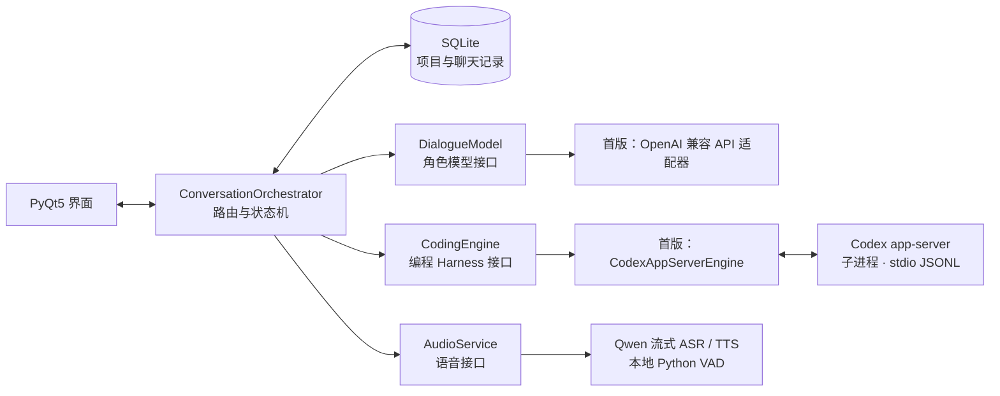

# 角色扮演 + AI 编程 Harness 设计

- 日期：2026-08-10
- 状态：用户已确认
- 修订：同日经用户确认，项目级沙箱、三种审批模式与审查智能体进入 MVP 范围
- 目标仓库：`E:\AI\HSR Partner Harness`
- 只读参考仓库：`E:\AI\二次元情感陪伴助手`

## 1. 目标

本项目是一个 PyQt5 前端、Python 后端的桌面应用，将角色扮演式陪伴聊天与本地 AI 编程 Harness 放在同一套会话系统中。

系统包含三组固定搭档：

| 角色 | 对应助手 |
|---|---|
| 白厄 | 神秘的古代机械 |
| 流萤 | 萨姆 |
| 三月七 | 第四面镜 |

角色负责人物对话、任务讨论和结果回应。对应助手负责文件操作、命令执行及工具调用。角色可以提出或调整任务，但永远不能产生工具事件。

新项目不包含 3D 角色展示、MMD 资源、动作、口型、换装、触摸互动、相册和 WebGL 链路。

## 2. 核心产品模型

### 2.1 项目、聊天与搭档

```text
Project（一个本地文件夹）
└─ Conversation（一次独立聊天）
   ├─ 固定的一组角色与助手
   ├─ Message（对话时间线）
   ├─ ToolRun（最终工具卡片）
   └─ EngineSessionRef（首版由 Codex 适配器映射到 thread）
```

每个项目绑定一个本地文件夹，同一项目下可以创建多次聊天。每条聊天固定一组搭档，不能在聊天内部切换成另一组搭档。

左侧搭档轨道的行为：

- 点击搭档后，打开它在当前项目中的最近聊天。
- 如果当前项目没有该搭档的聊天，则显示新聊天页面。
- 用户可以随时为该搭档再创建一条空聊天。

主窗口左上角提供项目与聊天库入口。展开后可以创建或切换项目，并按当前项目列出全部未归档聊天。聊天条目显示固定搭档、标题和更新时间，因此同一搭档的旧聊天可以直接选择，不受“最近聊天”限制。

系统另有不绑定文件夹的“日常陪伴聊天”区域。这里可以创建多次角色聊天，但不允许进入协作模式。如果用户尝试交付编程任务，界面要求先选择或创建项目文件夹。

### 2.2 新聊天与旧聊天

新聊天只继承角色卡、主题和声音配置，不继承旧聊天的上下文。首次向助手交付任务时，才由当前 `CodingEngine` 创建编程会话，并保存不透明的 `EngineSessionRef`。

旧聊天重新打开时，从 SQLite 恢复消息与工具卡片。再次交付任务时，如果存在 `EngineSessionRef`，交给当前适配器恢复；纯角色聊天没有该引用，按首次任务创建新的编程会话。首版 Codex 适配器在不透明引用内部保存 `thread_id`，应用层不读取它。

聊天标题在第一条用户消息后自动生成，用户可以手动重命名或归档。

## 3. 双模式与消息路由

### 3.1 聊天模式

- 角色对话扩展为全宽，助手工作台收起。
- 输入只能发给当前角色。
- 不产生工具事件。
- 支持 VAD、按键说话和文字输入。

### 3.2 协作模式

- 左侧是完整的角色扮演聊天。
- 右侧是对应助手的执行工作台。
- 默认发送对象是角色。
- 用户可以切换为“直接交给助手”。

“对角色说”的处理：

1. 普通聊天只产生角色回复，不影响正在执行的任务。
2. 明确工作意图会让角色先用人物口吻回应。
3. 角色同时提交结构化 `TaskRequest` 给对应助手。
4. 助手执行结束后生成 `ExecutionReceipt`。
5. Orchestrator 从真实回执派生 `CharacterResultSummary`。
6. 角色根据精简结果作人物化回应。

“直接交给助手”跳过角色模型，立即进入 `CodingEngine`。此路由只支持按键说话或文字输入。

助手执行期间，用户仍然可以与角色进行完整角色扮演聊天。角色只接收压缩后的进度摘要。明确修改任务时，角色生成 `TaskAmendment`。修改在当前工具步骤结束后应用，用户直接发给助手的新指令拥有最高优先级。

MVP 在整个应用范围内最多存在一个活动编程 turn。活动 turn 固定绑定创建时的 `project_id`、`conversation_id` 和 `task_id`；切换项目、聊天或搭档不会改变事件归属。活动 turn 结束或取消前，其他聊天不能启动新的助手任务。

## 4. 界面设计

### 4.1 主窗口

已确认的界面结构：

- 协作模式采用双栏分屏。
- 左侧显示角色对话。
- 右侧显示助手自然语言和工具卡片。
- 底部使用共享输入区。
- 左侧窄轨道切换三组搭档。
- 左上角项目与聊天库按钮可以展开或收起项目树和聊天历史列表。
聊天模式收起右侧工作台，角色对话占满剩余窗口。切回协作模式时恢复原来的工具记录和任务状态。

### 4.2 输入区

协作模式下，输入前先选择对象，再选择输入方式：

```text
发送给：白厄 | 神秘的古代机械
输入方式：VAD | 按住说话 | 文字
```

选择助手后，VAD 选项自动隐藏。

聊天模式隐藏发送对象选择器，目标固定为当前角色，只显示 VAD、按住说话和文字输入。

输入区左下角提供审批模式下拉选择框（布局参考 Codex），在“请求批准”“帮我审核”“完全允许运行”之间切换，选择按项目保存。

### 4.3 审批区

需要批准时，输入区正下方整体展开一个横跨窗口宽度的区域：第一行显示待审批操作的摘要，第二行是“允许”“本对话内允许”“否决”三个按钮。用户点击任一按钮后区域立即隐藏，裁决结果作为 `system` 卡片留在消息时间线。多个审批请求按产生顺序排队，逐条显示。

帮我审核模式下，该区域只显示“审查中”状态和审查智能体的最终裁决，不提供人工按钮；完全允许运行模式下该区域不出现。

### 4.4 工具记录

工具记录采用“摘要优先的折叠卡片”：

- 助手先显示简短自然语言说明。
- 命令、文件变更和检查结果默认折叠。
- 用户按需展开完整内容。
- 流式执行状态持续更新同一张卡片。

### 4.5 白厄与古代机械主题

白厄使用蓝色系：

| 用途 | 色值 |
|---|---|
| 浅色文字 | `#C7D4E3` |
| 主色 | `#8AA4D4` |
| 深层背景 | `#3A548C` |
| 激活状态 | `#296CE1` |

神秘的古代机械使用新铸青铜金：

| 用途 | 色值 |
|---|---|
| 标准古铜金 | `#B08D57` |
| 新铸亮金 | `#C5A059` |
| 阴影与岁月感 | `#8C6B3F` |

机械主题不使用氧化后的暗铜绿。流萤、萨姆、三月七和第四面镜的具体配色在白厄闭环完成后单独确认。

用户、工具和系统消息使用不随搭档切换的中性样式：

| 来源 | 视觉样式 |
|---|---|
| 用户 | 深蓝灰或低饱和紫灰气泡，浅灰文字 |
| 工具 | `#17191D` 炭黑卡片、`#373A40` 边框，成功或失败只用于状态标识 |
| 系统 | 无角色色气泡，使用低对比灰色提示文字 |

这些固定样式与角色色、助手色保持明确区分。

## 5. 系统架构



主应用是单个 PyQt5 + Python 进程，不额外启动本地 HTTP 服务。Codex app-server 作为子进程运行，通过标准输入输出交换 JSONL 事件。

`qasync` 负责衔接 Qt 与 `asyncio` 事件循环，`sounddevice` 负责本地麦克风采集和音频播放。

`ConversationOrchestrator` 是唯一的消息路由入口。PyQt 组件不直接调用模型、ASR、TTS 或工具。

### 5.1 可替换接口

```python
class DialogueModel:
    async def stream_reply(self, request) -> AsyncIterator[DialogueEvent]: ...

class CodingEngine:
    async def open_session(
        self,
        project,
        stored_ref: EngineSessionRef | None = None,
    ) -> EngineSessionRef: ...

    async def run_turn(
        self,
        session_ref: EngineSessionRef,
        request: TaskRequest,
    ) -> AsyncIterator[EngineEvent]: ...

    async def cancel_turn(
        self,
        session_ref: EngineSessionRef,
        turn_id,
    ): ...

    async def amend_turn(
        self,
        session_ref: EngineSessionRef,
        engine_turn_id,
        amendment: TaskAmendment,
    ): ...

    async def resolve_approval(
        self,
        session_ref: EngineSessionRef,
        approval_id,
        decision,
    ): ...

class SpeechRecognizer:
    async def stream_transcribe(self, audio_stream) -> AsyncIterator[AsrEvent]: ...

class SpeechSynthesizer:
    async def synthesize(self, request) -> AsyncIterator[AudioChunk]: ...

class VoiceActivityDetector:
    async def detect(self, pcm_stream) -> AsyncIterator[VadEvent]: ...
```

`DialogueEvent` 只允许 `speech.delta` 和经过结构校验的 `character.final`。身份、会话和搭档字段由 Orchestrator 写入，不能解析角色正文触发执行。

角色模型、编程后端、ASR、TTS 和 VAD 都通过接口与应用层连接。`EngineSessionRef` 是应用层只负责保存和回传的不透明引用。具体供应商的模型名、线程 ID 和原生事件保留在适配器内部。

首个编程适配器是 `CodexAppServerEngine`。支持 Responses 兼容协议的其他模型可以继续通过 app-server 配置；协议不同的 Harness 后续新增独立 `CodingEngine` 适配器。

## 6. 消息与执行协议

所有记录使用结构化身份字段：

| `source` | 内容 | 工具权限 | TTS |
|---|---|---:|---:|
| `user` | 文字或 ASR 转写 | 无 | 不合成 |
| `character` | 角色发言与委派 | 无 | 仅角色发言 |
| `assistant` | 工作说明与结果 | 通过 `CodingEngine` | 仅自然语言 |
| `tool` | 命令、补丁、运行结果 | 工具事件 | 永远静音 |
| `system` | 模式、错误、审批提示 | 无 | 永远静音 |

统一消息至少包含：

```python
Message(
    message_id,
    conversation_id,
    pair_id,
    turn_id,
    source,
    kind,
    text,
    payload,
    tts_eligible,
    created_at,
)
```

`tts_eligible` 由 Orchestrator 根据 `source` 和 `kind` 计算。模型与适配器不能自行设置该字段。

角色模型只能返回：

```python
CharacterTurn(
    speech="角色化自然语言",
    delegation=TaskRequestDraft(...) | TaskAmendmentDraft(...) | None,
)
```

角色模型永远不接收文件或命令工具定义。项目路径由 Orchestrator 注入，角色不能自行选择工作目录。模型只提出结构化草案，Orchestrator 校验后补齐关联字段：

```python
TaskRequest(
    task_id,
    conversation_id,
    origin_message_id,
    instructions,
    constraints,
    revision=0,
)

TaskAmendment(
    amendment_id,
    target_task_id,
    origin_message_id,
    revision,
    instructions,
)
```

“直接交给助手”也会先归一化为同一个 `TaskRequest`，再进入 `CodingEngine`。任务状态只允许按以下方向转换：

```text
pending → running → completed | failed | cancelled
            ↓
      amendment_pending → running
```

### 6.1 CodingEngine 统一事件

```python
EngineEvent(
    event_id,
    conversation_id,
    task_id,
    engine_turn_id,
    sequence,
    type,
    tool_call_id=None,
    payload=None,
)
```

`type` 使用以下稳定值：

```text
turn.started
assistant.delta
assistant.final
tool.started
tool.progress
tool.finished
file.patch
approval.requested
approval.resolved
turn.completed
turn.failed
```

`tool_call_id` 用于持续更新同一张工具卡片，`sequence` 用于恢复原始顺序。原始 `assistant.delta` 与 `tool.progress` 只用于实时显示；完成后持久化最终助手消息和最终工具记录。

app-server 原生审批请求作为结构化卡片显示。项目不建设独立权限中心；沙箱与审批模式作为任务执行的内建属性，见 §6.3。

### 6.2 执行回执

```python
ExecutionReceipt(
    task_id,
    engine_turn_id,
    status,
    summary,
    changed_files,
    checks,
    errors,
    pending_questions,
)
```

`status`、文件变更和检查证据由 Orchestrator 根据 `tool.finished`、`file.patch`、检查结果和审批事件形成。模型生成的总结只能作为展示字段，不能决定任务是否成功。

完整 `ExecutionReceipt` 只供 Orchestrator、助手工作台和持久化层使用。角色模型接收由它派生的精简回执：

```python
CharacterResultSummary(
    task_id,
    status,
    summary,
    user_visible_changes,
    limitations,
    pending_questions,
)
```

该摘要不包含原始路径、命令输出、错误堆栈或代码。失败状态不会被角色提示词包装成成功。

### 6.3 沙箱与审批模式

> 修订说明（O3.1，2026-08-11）：本节描述的审批职责划分已被 §14 修订——
> 真正暂停执行的一方是 app-server（approval policy + workspace-write），
> orchestrator 的 ApprovalManager 裁决后统一经 `resolve_approval` 转发，
> 应用层沙箱降级为兜底校验；原生审批事件不再单独透传为交互卡片。

MVP 沙箱是目录级约束：文件读写限制在项目根目录之内，命令执行的工作目录锁定为项目根。`..`、目录外绝对路径和指向目录外的符号链接由 Orchestrator 统一拦截。`CodexAppServerEngine` 把沙箱映射到 app-server 的 workspace-write 策略，应用层保留兜底校验。容器隔离不进入 MVP。

审批模式是项目级设置，在输入区左下角的下拉选择框切换（见 §4.2），默认“请求批准”：

| 模式 | 运行位置 | 审批行为 |
|---|---|---|
| 请求批准 | 沙箱内 | 每次工具调用与命令执行前挂起，用户选择允许、本对话内允许或否决 |
| 帮我审核 | 沙箱内 | 低风险操作直接放行；高风险操作由审查智能体裁决允许或否决 |
| 完全允许运行 | 沙箱外 | 直接操作，不拦截；工具与审批事件照常持久化 |

“本对话内允许”按“工具类型 + 操作签名”缓存，当前聊天结束后失效。

高风险判定使用全局规则表（与搭档无关的配置文件），覆盖删除、批量覆盖、git 破坏性命令、网络访问和依赖安装等类别。命中规则的操作连同近期上下文一起交给审查智能体。审查智能体只能读取上下文和待审批操作，输出结构化的允许或否决；否决时附一句简短理由和调整建议，回给助手用于修改方案。审查智能体不能修改文件、调用执行工具、创建子助手或继续委派，模型配置复用当前 `DialogueModel` 适配器。

`approval.requested` 与 `approval.resolved` 的 `payload` 记录决策方（`user` 或 `reviewer`）与理由。审查智能体的裁决以 `system` 来源的结构化卡片展示，始终静音。

## 7. 语音链路

### 7.1 输入矩阵

| 场景 | VAD | 按键说话 | 文字 |
|---|---:|---:|---:|
| 聊天模式，对角色说 | 可选 | 可选 | 可选 |
| 协作模式，对角色说 | 可选 | 可选 | 可选 |
| 协作模式，直接交给助手 | 不提供 | 可选 | 可选 |

### 7.2 VAD 与 ASR

麦克风统一采集 16 kHz 单声道 PCM。Python 端使用本地 Silero VAD，沿用旧项目的状态与初始参数思路：阈值 `0.45`，保留开口前音频，并判断结束等待和最短有效语音。

检测到说话开始后，系统建立 `qwen-audio-3.0-asr-flash-streaming` 会话并补发预录音频。识别增量实时显示在输入区，最终非空转写自动发送。误触发不会提交消息。

按键说话在按下时建立 ASR 流，松开后完成识别并自动发送。VAD 启动失败时退回按键说话。

### 7.3 TTS

TTS 使用 `qwen-audio-3.0-tts-flash`。三组搭档各有角色与助手声音，共六个 `VoiceProfile`。

只有以下消息进入 TTS：

- `character.speech`
- `assistant.natural_language`

以下内容始终静音：

- 命令和工具输出
- 文件路径与变更记录
- 代码块及行内代码
- 审批提示、系统状态和错误堆栈

助手 Markdown 输出按块拆分，只有自然语言段落进入 `SpeechQueue`。

TTS 播放期间暂停 VAD。播放结束后恢复原状态。用户可以停止当前语音并清空待播放队列；按下说话键也会先停止 TTS。

## 8. 持久化

默认应用数据目录：

```text
%LOCALAPPDATA%\PairHarness\
├─ pair_harness.db
└─ cache\
```

不保存原始麦克风录音。

SQLite 的核心记录：

| 表 | 职责 |
|---|---|
| `projects` | 名称、根目录、最近打开时间 |
| `conversations` | 标题、固定搭档、最后模式、时间戳 |
| `messages` | 用户、角色、助手和系统消息，以及工具卡片在时间线中的引用 |
| `tool_runs` | `conversation_id`、`task_id`、`engine_turn_id`、`tool_call_id`、顺序、状态、摘要和展开内容 |
| `engine_sessions` | `conversation_id`、`engine_type`、不透明 `session_ref`、最近 turn 引用、恢复状态 |

每条聊天最多对应一条当前 `engine_sessions` 记录。Codex `thread_id` 只存在于 `CodexAppServerEngine` 编码的不透明 `session_ref` 中。

消息在生成完成时立即写入数据库，不依赖应用退出时集中保存。

从应用中移除项目会归档项目及其聊天，不移动或删除磁盘文件。归档记录可以恢复。原路径不可用时仍可查看历史，协作模式暂停，直到用户重新选择有效文件夹。

## 9. 角色配置与上下文边界

三组搭档采用相同配置结构：

```text
config/pairs/
├─ phainon_ancient_machine.yaml
├─ firefly_sam.yaml
└─ march7_fourth_mirror.yaml
```

每组配置包含角色名称、角色提示词、助手提示词、声音配置和主题颜色。

角色模型接收：

- 固定角色卡
- 当前聊天中的用户与角色消息
- 当前任务的 `CharacterProgressSummary`，不包含原始工具输出
- 最终 `CharacterResultSummary`

对应助手接收：

- 通用 Harness 规则
- 助手自身的表达配置
- 当前项目路径
- 结构化任务与用户约束
- 少量与任务直接相关的近期对话

普通角色聊天不整段进入 Codex 上下文。MVP 使用近期消息窗口；自动压缩与跨聊天长期记忆在后续版本实现。

## 10. 原项目复用边界

参考仓库 `E:\AI\二次元情感陪伴助手` 默认只读，并保留其中已有的未提交改动与本地资源。

优先评估和小范围改造：

- 角色卡解析与角色配置思路
- 对话编排和模型供应商封装
- ASR/TTS 客户端
- VAD 状态与交互参数
- 已有相关测试

不搬迁：

- React/Next.js 页面和 Web/PWA 状态管理
- Three.js、MMD、动作、口型和模型资源
- WebGL 与浏览器音频实现

VAD 在 Python 中重新实现，只复用行为和参数，不复制浏览器 TypeScript/WASM 链路。

本项目只参考 Herta 的“人格前台与执行后端分离”机制，并独立实现 Python/PyQt 版本。Herta 源码适用其 MIT License；若未来复制或改造其源码，必须保留许可证与版权声明。其 prompts、persona/canon、artwork 和 voice 明确不在该 MIT 授权范围内，未经另行许可不复用。本项目也不复用 Electron/React、字面 `@板砖` 或梦境监督器实现。

## 11. MVP 开发顺序

1. 定义消息、委派、回执和不透明编程会话引用协议。
2. 跑通白厄与神秘的古代机械纯文本闭环，包括 Codex app-server 工具执行。
3. 实现项目级沙箱与三种审批模式，包括高风险规则表和审查智能体。
4. 接入最小 PyQt5 双栏、折叠工具卡片和取消操作。
5. 增加 SQLite 项目、聊天历史和编程会话恢复。
6. 接入 Python VAD、Qwen ASR 和两套声音。
7. 扩展流萤与萨姆、三月七与第四面镜。

### 11.1 MVP 验收

- 不同文件夹可以建立不同项目。
- 每个项目可以创建和恢复多次聊天。
- 旧助手聊天可以恢复对应编程会话；首版由 Codex 适配器恢复其 thread。
- 角色保持人物口吻并只提交结构化委派。
- 只有助手能产生工具事件。
- 协作执行期间仍可与角色聊天。
- 白厄与神秘的古代机械上下文、颜色和声音不串线，完整文本与语音闭环通过。
- 输入矩阵与 TTS 静音边界符合本设计。
- 沙箱拦截项目根目录外的文件与命令操作。
- 三种审批模式可按项目切换；请求批准模式下每次工具与命令操作都可以允许、本对话内允许或否决。
- 帮我审核模式下高风险操作由审查智能体裁决，否决时附带理由和调整建议。
- 完全允许运行模式不拦截操作，工具与审批事件照常持久化。
- 应用不加载任何 3D/MMD 资源。

另外两组搭档加入后，再执行三组切换不串线的扩展验收。

## 12. MVP 后续开发

### 12.1 必要增强

- 增加第二个 `DialogueModel` 适配器。
- 在首版稳定后增加第二个 `CodingEngine` 适配器。
- 增加会话压缩和 Token 使用显示。
- 增加可编辑的简单长期记忆。
- 增强文件 Diff 阅读和统一结果复查。
- 增加聊天搜索与归档恢复。
- 增加本地审批日志，集中记录人工批准与审查智能体的裁决及理由。

“结果复查”指把完成内容、变更文件、检查结果和遗留问题集中展示，并生成 `ExecutionReceipt`；它与帮我审核模式中的审查智能体相互独立。

### 12.2 有真实需求后再加入

- UI 截图任务需要时接入视觉模型。
- 单次任务确实需要长时间运行时，加入有结束条件的长任务模式。
- 长任务出现中断时，加入检查点和时间预算。
- 需要访问明确外部服务时，由具体 `CodingEngine` 适配器直接连接对应 MCP Server。
- 运行不可信代码时，在目录级沙箱之上按项目增加可选容器隔离。
- 放开并行编程 turn 时，用 git worktree 做任务间隔离；跨工作树的冲突预检与合并在有真实需求后再加。

长任务只继续执行用户已经提交的当前目标，必须同时配置明确结束条件、最大时间、最大轮数和手动取消。它不生成新目标，不定时启动任务，也不常驻后台。

### 12.3 当前不建设

- 复杂多 Agent 群体和动态拓扑
- 永久在线自治和自动目标生成
- 完整 RBAC、审计平台和企业治理体系
- 自建遥测与全链路观测平台
- Electron、React 和原项目 Web 前端
- 字面触发词 `@板砖`
- 梦境监督器、rethink/reveal 等隐藏多轮链路
- 容器集群和微服务编排（单项目可选容器见 §12.2）

### 12.4 永久排除

**项目永远不建设自定义 MCP 网关、统一 MCP 代理层或 MCP 工具市场。**

未来若需要外部能力，只允许由具体 `CodingEngine` 适配器直接配置并连接用途明确的 MCP Server。`ConversationOrchestrator` 不枚举、聚合、路由或代理 MCP 工具。项目永远不建立共享 MCP 客户端层、注册表、代理层或工具市场。

## 13. 最小错误处理

- 角色模型失败：保留用户消息并提供重试。
- app-server 退出：当前任务标记失败，下次任务前重新启动子进程。
- 项目路径失效：历史可读，协作模式暂停。
- ASR 失败：保留输入状态并允许改用文字。
- TTS 失败：文字正常显示，不阻塞会话。

MVP 不建设生产级遥测、复杂恢复系统或自定义权限治理。

## 14. O3.1 审批体系统一修订（2026-08-11）

> 本修订稿由优化计划 O3.1 产出，2026-08-11 经用户确认，并入设计基线。
> 涉及章节：§5.1（CodingEngine 接口）、§6.1（统一事件）、§6.3（沙箱与审批）。

### 14.1 背景与问题

1. **门控名不副实**：orchestrator 在 `tool.started` 事件之后做沙箱与审批门控。
   对真实引擎而言，工具操作此时已经执行，门控只能事后标记，无法阻止。
2. **`resolve_approval` 悬空**：`CodingEngine.resolve_approval` 定义在接口中
   但全仓无人调用，引擎侧审批与应用层审批两套机制并存、互不接通。
3. **协议假设错误**：原 codec 假设 app-server 以通知形式发送
   `item/approval/requested`、并以 `item/approval/respond` 请求回复。
   经 `codex app-server generate-json-schema`（0.147.0）确认，真实协议是
   **服务端发起的 JSON-RPC 请求**（带 `id` 与方法名），以 `result` 回复决策。

### 14.2 修订后的职责划分

| 职责 | 承担方 | 说明 |
|---|---|---|
| 真正暂停执行 | app-server | thread/start 配置 `approvalPolicy`（如 `"on-request"`）后，工具操作执行前挂起并发起 `requestApproval` 请求 |
| 执行边界 | app-server | thread/start 配置 `sandbox: "workspace-write"`（MVP 目录级约束的引擎侧实现） |
| 裁决中枢 | orchestrator `ApprovalManager` | 三种审批模式逻辑不变；裁决结果统一经 `CodingEngine.resolve_approval` 转发回引擎 |
| 兜底校验 | orchestrator 沙箱 | app-server 策略未配置或演示引擎路径下仍执行目录级拦截；原生路径下在挂起时同步检查（越界直接否决） |
| 交互卡片 | ApprovalManager 裁决流程 | 请求批准模式的按钮卡片由 approval_callback 驱动；审查模式的状态展示由合成事件驱动；**原生事件不再单独透传为交互卡片** |

### 14.3 真实协议事实（schema 确认，0.147.0）

**thread/start 策略字段**（v2 协议，`ThreadStartParams`）：

| 字段 | 取值 | 用途 |
|---|---|---|
| `approvalPolicy` | `"untrusted"` / `"on-request"` / `"never"` / `{"granular": {...}}` | 何时请求批准 |
| `sandbox` | `"read-only"` / `"workspace-write"` / `"danger-full-access"` | 执行沙箱 |
| `approvalsReviewer` | `"user"` / `"auto_review"` / `"guardian_subagent"` | 审批请求的默认裁决方 |

**审批请求**（v1 协议，服务端 → 客户端，带 JSON-RPC `id`，客户端以
`{"id": ..., "result": {"decision": ...}}` 回复）：

| 方法 | params 关键字段 | 语义 |
|---|---|---|
| `item/commandExecution/requestApproval` | `itemId`、`command`、`cwd`、`reason` | 命令执行前挂起 |
| `item/fileChange/requestApproval` | `itemId`、`grantRoot`、`reason`、`threadId`、`turnId` | 文件写入/修改前挂起 |
| `item/permissions/requestApproval` | `itemId`、`permissions`、`reason`、`threadId`、`turnId` | 权限扩展（网络等）前挂起 |

**决策枚举**（`CommandExecutionApprovalDecision`）：`accept`、
`acceptForSession`、`acceptWithExecpolicyAmendment`、
`applyNetworkPolicyAmendment`、`decline`、`declineAndInterrupt`。

### 14.4 事件流（请求批准模式示例）

```text
模型调用工具
  → app-server 挂起，发起 item/commandExecution/requestApproval（id=N）
  → codec 映射为 EngineEvent APPROVAL_REQUESTED
     （payload：approval_id=N、tool_kind、command、paths、reason）
  → orchestrator 沙箱兜底（越界 → 回复 decline）
  → ApprovalManager.adjudicate：
      缓存命中 → 直接 ALLOW
      未命中   → approval_callback 询问用户（交互卡片）
  → 合成 APPROVAL_RESOLVED 事件（payload 记录 decision/actor/reason）
  → coding_engine.resolve_approval(session, N, decision)
       → transport.respond(N, {"decision": "accept"|"decline"})
  → app-server 执行或拒绝；后续 item/started、item/completed 等照常推送
```

审查模式：同一路径，裁决主体为审查智能体（REVIEW 高风险时），
`actor=reviewer`，附带理由与调整建议。完全允许运行模式：无用户交互，
直接回复 `accept`（仅当引擎仍发起请求时）。

被否决（`decline`）时 orchestrator **不中断执行循环**：引擎把拒绝反馈给
模型后继续 turn，任务成败由 turn 终态决定。这与兜底路径（`tool.started`
后门控，否决即中断任务）的语义不同，两者按引擎是否发起原生请求区分。

### 14.5 决策映射（应用层 → 原生）

| 应用层 ApprovalDecision | 原生 decision | 说明 |
|---|---|---|
| `ALLOW` | `accept` | 允许执行 |
| `ALLOW_FOR_CONVERSATION` | `accept` | “本对话内允许”由应用层会话缓存实现（O1.5 收紧规则始终生效），不依赖原生 `acceptForSession`；B1 联调可评估切换 |
| `DENY` | `decline` | 拒绝，引擎继续 turn |

### 14.6 策略映射（应用层 → thread/start，B1 联调落实）

| 应用层审批模式 | approvalPolicy | sandbox | approvalsReviewer |
|---|---|---|---|
| 请求批准 | `"on-request"` | `"workspace-write"` | `"user"` |
| 帮我审核 | `"on-request"` | `"workspace-write"` | `"user"`（应用层审查智能体裁决；原生 `auto_review` 作为备选评估项） |
| 完全允许运行 | `"never"` | `"workspace-write"` | `"user"` |

`open_session` 已预留 `approval_policy`/`sandbox`/`approvals_reviewer` 参数
（§5.1），编排器在 B1 联调时按上表传入；`None` 表示不设置。

### 14.7 适配器预备改动清单（O3.1 已实现）

- `transport.py`：读循环区分“服务端请求”（id + method）与“响应”，
  服务端请求进通知队列；新增 `respond(request_id, result)`。
- `codec.py`：`item/*/requestApproval` 映射为 `APPROVAL_REQUESTED`，
  `approval_id` 取请求 id；保留旧 `item/approval/requested|resolved` 兼容映射。
- `engine.py`：`open_session` 预留策略参数；`resolve_approval` 改为按请求
  id 回复 result（决策映射见 §14.5）。
- `approval.py`：`ApprovalManager.adjudicate()`——裁决引擎侧挂起请求，
  不重复合成请求事件，只返回 resolved 事件。
- `orchestrator.py`：事件循环处理 `APPROVAL_REQUESTED`（沙箱兜底 +
  adjudicate + resolve_approval 转发）；`tool.started` 门控仅对未原生裁决
  的操作执行（`adjudicated_tool_ids` 去重）；新增
  `_operation_from_approval_event`。

### 14.8 B1 联调清单

1. 以真实 app-server 启动，按 §14.6 传入 thread/start 策略参数，确认
   `requestApproval` 请求的 params 字段与 §14.3 一致（尤其
   `item/fileChange/requestApproval` 的 `grantRoot` 语义）。
2. 三种审批模式全链路走通：挂起 → 应用层裁决 → respond → 执行/拒绝。
3. 验证 `decline` 后模型能否收到拒绝反馈并调整方案（决定是否需要在
   编排器层补 TOOL_FINISHED(denied) 事件）。
4. 评估原生 `acceptForSession` 与应用层会话缓存的取舍（§14.5）。
5. 沙箱兜底在原生路径下的行为对齐（越界请求直接 decline）。

