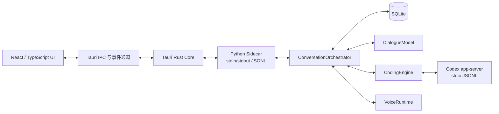

# Tauri + React + Python Sidecar 桌面架构迁移设计

- 日期：2026-08-11
- 状态：待用户书面确认
- 目标仓库：`E:\AI\HSR Partner Harness`
- 基线提交：`294851f`
- 关联设计：`docs/specs/2026-08-10-roleplay-coding-harness-design.md`

## 1. 决策与目标

桌面端改用以下技术组合：

- Tauri 2：桌面窗口、原生对话框、应用生命周期与 Python Sidecar 管理。
- React + TypeScript + Vite：全部可见界面与交互。
- Python Sidecar：继续运行现有编排器、模型适配器、Codex app-server 适配器、SQLite 和语音链路。
- stdin/stdout JSONL：Tauri 与 Python 之间的唯一运行时通信通道。

本次迁移的核心目标是获得适合长期打磨的高质量界面基础，同时保留已经完成的 Python 业务能力。迁移不重新实现角色委派、任务状态机、审批规则、Codex 协议、语音模型或持久化语义。

用户对产品层已经确认的规则继续有效：角色没有工具执行权；助手独占工具执行权；聊天模式与协作模式并存；项目、聊天和搭档保持固定关系；工具记录与系统状态静音；整个应用最多运行一个编程 turn。

## 2. 本次取代的旧约束

原设计中的以下技术约束由本设计取代：

- 主界面不再使用 PyQt5 Widgets。
- 应用不再要求单个 Python + Qt 进程。
- 前端可以使用浏览器渲染技术。
- `qasync`、`OrchestratorBridge`、QSS 主题和 PyQt UI 组件不再属于最终桌面架构。

以下边界继续保留：

- 不恢复 3D、MMD、动作、口型、换装、相册和 WebGL 角色展示链路。
- 不建设自定义 MCP 网关、工具市场或复杂多 Agent 拓扑。
- 不把 Python 业务逻辑迁移到 Rust 或 TypeScript。
- 不改变现有 SQLite 数据语义和应用数据目录。

## 3. 总体架构



### 3.1 React 前端

React 只保存界面状态和服务端状态的前端投影。它不直接访问项目文件、SQLite、模型 API、Codex 进程或音频设备。

前端职责：

- 渲染项目、聊天、角色区、助手区、输入区、工具卡片和审批区。
- 接收 Python 推送的快照和增量事件。
- 把用户操作转换成结构化命令。
- 管理局部界面状态，例如面板宽度、折叠状态、滚动位置和临时输入。
- 执行 Markdown、代码和差异视图渲染。
- 保持键盘操作、焦点和动效一致。

前端不得依据文本猜测消息身份、任务状态或工具类型。所有判断都读取协议字段。

### 3.2 Tauri Rust Core

Rust 层保持很薄，只承担桌面外壳职责：

- 创建主窗口并加载前端静态资源。
- 启动、监控和结束 Python Sidecar。
- 把前端命令写入 Sidecar stdin。
- 按行读取 Sidecar stdout，并转换成 Tauri 事件发给前端。
- 提供文件夹选择、窗口状态和应用退出等原生能力。
- 在开发模式启动 `.venv` Python；发布模式启动打包后的 Sidecar 可执行文件。

Rust 层不解析角色语义、不组装模型提示词、不判断审批风险，也不写业务数据库。

### 3.3 Python Sidecar

Python Sidecar 是现有应用核心的新入口。它负责：

- 初始化 Settings、SQLiteStore、ConversationOrchestrator、DialogueModel、CodingEngine 和 VoiceRuntime。
- 接收前端命令并调用现有应用服务。
- 把消息、工具、审批、任务和语音状态转换成桌面事件。
- 生成首次快照，并在切换项目或聊天时重新生成当前上下文快照。
- 保证事件仍归属发起任务的 `conversation_id`。
- 退出前完成当前资源的最小清理。

现有 `src/pair_harness/ui/` 中混合了 UI 装配和业务装配的部分需要拆开。可复用装配进入独立的 `ApplicationService` 或等价模块，PyQt 入口和 Sidecar 入口都能暂时调用它，直到迁移完成。

## 4. 进程与生命周期

### 4.1 启动

1. Tauri 创建窗口并显示本地启动页。
2. Rust 启动 Python Sidecar。
3. Python 完成配置、数据库和适配器初始化。
4. Python 输出 `backend.ready`。
5. 前端请求 `app.bootstrap`。
6. Python 返回项目列表、当前项目、当前聊天、当前搭档、消息、工具记录和运行状态快照。
7. 前端一次性提交快照并进入主界面。

启动页不轮播宣传文案，只显示应用标识、初始化状态和失败后的“重试”按钮。

### 4.2 运行

- Rust 为所有前端命令分配关联 ID，并维持等待中的请求表。
- Python 对每个命令返回成功或失败响应。
- 流式消息、工具进度、审批和语音状态走独立事件，不等待命令响应结束。
- 前端以稳定 ID 更新已有实体，不能靠数组位置更新。

### 4.3 退出与异常

- 正常退出时，Rust 先发送 `app.shutdown`，最多等待 Python 2 秒确认，然后结束 Sidecar。
- Python 意外退出时，前端进入后端断开页面，保留尚未发送的输入草稿。
- MVP 提供手动“重新连接”按钮。自动无限重启、崩溃上报和后台守护不进入本次迁移。
- Codex、模型 API 或语音服务异常继续由现有 Python 层转换成用户可见系统消息。

## 5. IPC 协议

每行都是一个完整 JSON 对象。stdout 只写协议消息；诊断日志写 stderr，避免污染解析。

### 5.1 前端命令

```json
{
  "kind": "request",
  "id": "req_01",
  "method": "chat.submit",
  "params": {
    "conversation_id": "conv_01",
    "target": "character",
    "text": "帮我看看这个项目"
  }
}
```

### 5.2 命令响应

```json
{
  "kind": "response",
  "id": "req_01",
  "ok": true,
  "result": {}
}
```

失败响应：

```json
{
  "kind": "response",
  "id": "req_01",
  "ok": false,
  "error": {
    "code": "conversation_not_found",
    "message": "聊天不存在"
  }
}
```

### 5.3 后端事件

```json
{
  "kind": "event",
  "event": "message.created",
  "sequence": 18,
  "payload": {
    "message": {}
  }
}
```

事件在单次 Python 进程生命周期内保持单调递增的 `sequence`。业务实体继续使用自身稳定 ID。前端发现序号跳跃时重新调用 `app.bootstrap` 获取完整快照，不尝试猜测缺失内容。

### 5.4 命令集合

首版命令固定为：

| 命令 | 用途 |
|---|---|
| `app.bootstrap` | 获取启动快照 |
| `app.shutdown` | 正常退出 |
| `project.create` | 登记用户通过原生对话框选中的项目目录 |
| `project.select` | 切换项目 |
| `project.update_settings` | 修改审批模式、推理档位等项目设置 |
| `conversation.create` | 在项目或日常聊天区创建聊天 |
| `conversation.select` | 切换聊天并恢复快照 |
| `conversation.rename` | 修改标题 |
| `conversation.archive` | 归档聊天 |
| `chat.submit` | 向角色或助手提交文字 |
| `task.cancel` | 取消当前编程 turn |
| `approval.resolve` | 用户处理审批请求 |
| `voice.vad_set` | 开关 VAD |
| `voice.ptt_start` | 开始按键说话 |
| `voice.ptt_stop` | 结束按键说话 |
| `voice.tts_stop` | 停止当前朗读并清空队列 |

项目文件夹选择由 Tauri Dialog 完成，Python 只接收用户已经选择的绝对路径。其他项目读写仍由 CodingEngine 和现有沙箱规则处理。

### 5.5 事件集合

首版事件固定为：

| 事件 | 用途 |
|---|---|
| `backend.ready` | Python 初始化完成 |
| `state.snapshot` | 事件序号中断或后端要求刷新时，替换当前完整界面状态 |
| `message.created` | 新增完成态消息 |
| `message.delta` | 更新流式助手正文或思考内容 |
| `message.finalized` | 流式消息完成 |
| `tool_run.upserted` | 新增或更新工具卡片 |
| `approval.requested` | 展开当前审批条 |
| `approval.resolved` | 隐藏审批条并更新系统卡片 |
| `task.busy_changed` | 全局编程 turn 状态变化 |
| `conversation.changed` | 当前聊天变化 |
| `project.changed` | 当前项目或项目设置变化 |
| `voice.asr_partial` | 更新输入区临时转写 |
| `voice.state_changed` | VAD、PTT、TTS 状态变化 |
| `error.reported` | 展示非致命错误 |

`message.delta` 在 Python 端按约 30 至 50 ms 合并后再发送。音频 PCM、TTS 音频帧和原始麦克风数据不经过前端 IPC。

## 6. 前端信息架构

### 6.1 主窗口

主窗口分为四个稳定区域：

1. 左侧导航栏：项目、聊天、搭档与新建入口。
2. 中央角色区：用户与角色对话。
3. 右侧助手区：助手自然语言、工具卡片、执行状态和文件变化。
4. 底部输入区：目标、文字输入、语音控制、审批模式和推理档位。

协作模式显示角色区与助手区，可拖动分栏。聊天模式隐藏助手区，角色区占满内容区域。窗口尺寸变化不能重建当前消息树，也不能打断正在进行的任务或语音。

### 6.2 导航

- 项目和聊天使用同一条左侧导航，不弹出覆盖全屏的第二套页面。
- 搭档选择与聊天历史明确分层，避免用户把“切换搭档”和“切换聊天”混为一件事。
- 活动任务所属聊天显示运行标记；用户切到其他聊天后，任务事件继续写回原聊天。
- 日常聊天区与项目聊天区保持明显区分，日常聊天中隐藏协作入口。

### 6.3 消息区

- 角色区与助手区分别使用虚拟列表。
- 消息实体以 `message_id` 为 React key。
- 新事件到达时，只有用户已经接近列表底部才自动跟随滚动。
- 用户向上查看历史时显示“回到最新消息”，不强制抢回滚动位置。
- Markdown 正文限制阅读宽度，代码块和差异视图可以横向滚动。
- 思考内容默认折叠，展开状态只属于前端局部状态。

### 6.4 工具与审批

- 同一个 `tool_call_id` 始终更新同一张卡片。
- 卡片标题先显示动作摘要与状态，原始命令、路径和输出放在展开区。
- 运行中只对状态点和进度条使用动画，日志文本不逐行制造入场动画。
- 审批条固定在输入区上方，保持操作按钮位置稳定。
- 用户处理审批后立即禁用按钮，收到 `approval.resolved` 后收起。

### 6.5 输入与键盘

- `Enter` 发送，`Shift+Enter` 换行。
- 发送期间输入框仍可编辑；直接交给助手的新指令按现有 amendment 路由处理。
- `Esc` 优先关闭当前弹层，其次取消输入焦点，不直接取消运行任务。
- 所有按钮和折叠卡片都有可见焦点样式。
- PTT 使用明确的按下、录音中和松开状态，窗口失焦时自动结束本次 PTT。

## 7. 视觉系统

### 7.1 基础方向

界面采用克制的深色桌面工作台风格，角色品牌色用于身份与激活状态。避免大面积霓虹、持续发光、装饰性粒子和高频背景动画。

基础字体：

- 中文和 UI：`Inter`、`Microsoft YaHei UI`、`PingFang SC`、系统无衬线字体回退。
- 代码与命令：`Cascadia Mono`、`JetBrains Mono`、`Consolas` 回退。

主题通过 CSS Variables 统一管理。当前 `PairTheme` 的白厄蓝色组和古代机械青铜金继续作为锁定品牌值，React 不在组件内复制颜色常量。

### 7.2 组件原则

- Radix UI 提供无样式交互基础，最终外观由项目设计系统决定。
- 图标统一使用 Lucide SVG，不混用 Emoji 和不同风格图标。
- 阴影和透明层级用于区分面板，不能牺牲正文对比度。
- 可点击组件在 hover、active、focus 和 disabled 状态下都有稳定反馈。
- hover 不使用会改变布局尺寸的缩放。

### 7.3 动效

- 常规状态过渡控制在 150 至 250 ms。
- 进入使用 ease-out，退出使用 ease-in。
- 优先动画 `transform` 与 `opacity`。
- 每个视图同时出现的显著动画不超过两个。
- 遵守 `prefers-reduced-motion`，关闭非必要过渡。
- 流式文字直接更新内容，不使用逐字弹跳或闪烁光标特效。

## 8. 前端技术边界

首版采用：

- React + TypeScript + Vite
- Zustand：服务端状态投影和少量跨区界面状态
- TanStack Virtual：角色与助手长列表
- Radix UI：下拉框、弹层、提示和可访问交互基础
- Motion：有限的状态过渡
- `react-markdown` + GFM：消息 Markdown
- Shiki：代码高亮，按需初始化
- Monaco Editor：仅在后续文件或 Diff 视图需要时懒加载，首个迁移闭环不强制加入
- Lucide：统一图标

不采用 Next.js、SSR、浏览器路由服务器或通用组件主题模板。桌面应用只有一个前端入口，页面切换由本地状态驱动。

## 9. 状态归属

| 状态 | 唯一权威来源 |
|---|---|
| 项目、聊天、消息、工具记录 | Python + SQLite |
| 当前编程任务和审批 | Python Orchestrator |
| 角色与助手配置 | Python 配置加载器 |
| ASR、TTS、VAD 状态 | Python VoiceRuntime |
| 当前窗口尺寸与位置 | Tauri |
| 面板宽度、卡片折叠、滚动位置、输入草稿 | React |
| 深浅主题选择 | Tauri Store 保存应用级偏好，React 应用 CSS Variables |

前端重载后必须能从 `app.bootstrap` 快照恢复业务状态。只存在于 React 的局部状态允许丢失，输入草稿应保存在当前 WebView 会话中。

## 10. 数据与兼容

- 继续使用 `%LOCALAPPDATA%\PairHarness\pair_harness.db`。
- 不迁移或复制现有数据库。
- Python Sidecar 启动时继续执行现有 SQLite schema 迁移。
- 已有项目、聊天、消息、工具卡片、审批模式、推理档位和 EngineSessionRef 必须原样恢复。
- PyQt 与 Tauri 迁移期间不能同时写同一个数据库；开发联调时一次只启动一个桌面入口。
- 发布切换完成前保留旧 PyQt 入口，作为人工对照和短期回退路径。

## 11. 迁移策略

迁移采用纵向闭环顺序，避免同时重写全部页面：

1. 保留当前工作区内尚未提交的 PyQt 美化和语音启动改动，不清理、不重置，也不混入迁移提交。
2. 抽离 Python 应用装配，建立无 Qt 依赖的 Sidecar 协议入口。
3. 建立 Tauri + React 空壳，跑通启动、快照、命令和事件。
4. 迁移项目与聊天导航、聊天模式和文字输入。
5. 迁移协作模式、工具卡片、审批与取消。
6. 迁移 VAD、PTT、ASR 临时转写和 TTS 控制。
7. 完成长对话虚拟化、键盘路径、主题和动效打磨。
8. 打包 Python Sidecar 与 Windows 安装包。
9. 完成等价验收后删除 PyQt 最终入口和依赖。

每一步都在同一套 Python 核心上工作。前端可先连接测试适配器，再连接真实 DeepSeek、Codex 和 Qwen 服务。

## 12. 测试设计

### 12.1 Python

- 保留现有 core、adapter、storage、contract 和真实服务测试。
- 新增 Sidecar 协议单元测试，覆盖命令解析、响应关联、事件序号和错误输出。
- 新增 Sidecar 集成测试，使用内存或临时 SQLite 与测试适配器跑通完整文字闭环。
- stdout 协议测试断言每一行都是合法 JSON，诊断信息只进入 stderr。

### 12.2 Rust

- 测试 Sidecar 启动命令选择、stdin 写入和 stdout 行拆分。
- 测试 Python 退出后向前端发送断开状态。
- 不为简单 Tauri 配置搭建大型测试框架；核心桥接逻辑保持为可独立测试的小模块。

### 12.3 React

- 使用 Vitest + Testing Library 覆盖 store、协议映射和关键组件行为。
- 使用稳定测试 ID 只覆盖难以通过角色或文本定位的元素。
- 测试流式 delta 更新同一消息、工具卡片 upsert、审批按钮禁用、聊天切换和滚动跟随规则。

### 12.4 桌面验收

- 使用 Playwright Web 测试前端静态构建的主要交互。
- Tauri 完整窗口做少量人工验收，覆盖原生文件夹选择、Sidecar 启动、真实语音和真实 Codex。
- 迁移完成前，使用同一组测试适配器数据对照 PyQt 与 React 的业务结果，不要求像素完全一致。

## 13. 性能与体验验收

以下指标用于发现明显退化，不作为生产级性能体系：

- Windows 常用开发机上，窗口出现后能立即响应拖动和点击；后端初始化期间不冻结窗口。
- 500 条混合消息的聊天滚动保持稳定，无持续掉帧和明显输入延迟。
- 流式消息和工具事件到达后，界面在一个合并周期内更新。
- 输入长文本、展开工具卡片和拖动分栏时不阻塞语音或 Codex 事件接收。
- 当前聊天不在底部时，新消息不抢夺用户滚动位置。
- 深浅主题切换不重新创建业务状态，也不闪出未设置主题的白屏。
- 键盘可以完成发送、切换目标、处理审批和展开工具记录。

## 14. MVP 错误处理

| 场景 | 用户可见行为 |
|---|---|
| Python 启动失败 | 启动页显示原因摘要与重试按钮 |
| IPC 行无法解析 | 丢弃该行，stderr 记录；前端收到协议错误提示 |
| 命令参数错误 | 对应请求返回结构化错误，界面保留用户输入 |
| 当前聊天已切换 | 事件仍按 `conversation_id` 写回原聊天 |
| Sidecar 中途退出 | 进入断开页，允许手动重启后重新 bootstrap |
| 真实模型或 Codex 失败 | 沿用现有系统消息、回执和角色结果规则 |
| ASR/TTS 失败 | 输入继续可用，显示静音状态提示 |

本阶段不加入自动更新、遥测、崩溃上传、后台常驻和复杂恢复协议。

## 15. 发布形态

### 15.1 开发模式

- Vite 开发服务器提供热更新。
- Tauri 启动 `.venv\Scripts\python.exe -m pair_harness.desktop_backend`。
- Python 和前端测试可以独立运行。

### 15.2 发布模式

- Vite 产物嵌入 Tauri 应用。
- Python 后端首版使用 PyInstaller `onedir` 打包，避免 `onefile` 每次启动时解压；Sidecar 主程序由 Tauri `externalBin` 收入安装包，依赖目录和模型资源作为应用资源一并发布。
- Tauri 使用 Windows WebView2。
- 首个正式目标只覆盖 Windows x64；其他平台等真实需求出现后再增加。

## 16. 切换标准

满足以下条件后，Tauri 成为默认入口：

1. 项目和聊天可以创建、切换、恢复、重命名和归档。
2. 聊天模式与协作模式的路由和显示正确。
3. 角色委派、助手执行、工具卡片、审批、取消和 amendment 全部跑通。
4. 真实 DeepSeek、Codex app-server、Qwen ASR/TTS 与 SQLite 在 Tauri 入口下可用。
5. 身份、TTS 静音、项目沙箱和审批语义没有改变。
6. 长对话、流式更新、键盘操作和窗口缩放达到 §13 的体验标准。
7. Windows 开发构建和安装包均能启动 Python Sidecar。
8. 全部 Python 非 UI 测试与新增前端、协议测试通过。

切换后删除 PyQt UI 代码、pytest-qt 测试和 `ui` 可选依赖。删除动作单独提交，不能与核心迁移混在同一阶段。

## 17. 明确不进入本次迁移

- 3D/MMD 角色展示
- 多窗口与移动端
- 自动更新和崩溃上报
- 跨设备同步
- 插件市场和自定义 MCP 网关
- Python 业务逻辑迁移到 Rust
- 重写 SQLite schema 或迁移历史数据
- 同时扩展另外两组尚未完成的角色内容
- 完整文件浏览器和 IDE 级编辑器

这些能力以后有明确需求时再单独设计。
